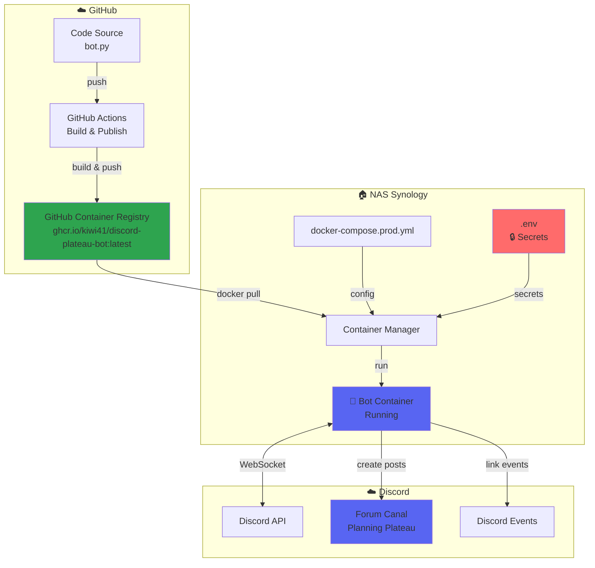
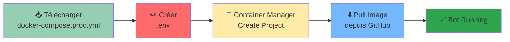
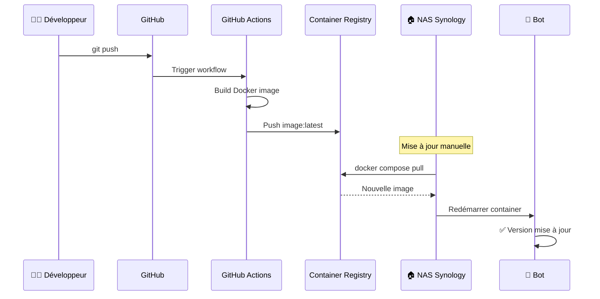

# 🚀 Guide de Déploiement - Discord Bot Soirées Plateaux sur Synology

Ce guide détaille le déploiement du bot en container Docker sur votre NAS Synology.

## 📊 Architecture de Déploiement



---

## 🏠 Déploiement sur NAS Synology

### Prérequis
- NAS Synology avec DSM 7.0+
- Package "Container Manager" installé
- Connexion internet stable
- Accès SSH (optionnel, pour méthode avancée)

---

## 🚀 Méthode Rapide : Utiliser l'Image Pré-compilée (Recommandé)

Cette méthode utilise l'image Docker pré-compilée depuis GitHub Container Registry. **Pas besoin de compiler l'image localement !**



### Via Container Manager (Interface Web)

1. **Préparer le dossier** :
   - Créer `/docker/discord-plateau-bot/` dans File Station
   - Télécharger [docker-compose.prod.yml](https://raw.githubusercontent.com/Kiwi41/discord-plateau-bot/master/docker-compose.prod.yml)
   - Uploader le fichier dans le dossier créé

2. **Créer le fichier .env** :
   - Dans File Station, créer un fichier `.env`
   - Ajouter vos identifiants Discord :
   ```bash
   DISCORD_TOKEN=votre_token_bot
   GUILD_ID=votre_guild_id
   FORUM_CHANNEL_ID=votre_forum_channel_id
   REGISTRATION_URL=votre_lien_inscription
   TIMEZONE=Europe/Paris
   ```

3. **Déployer** :
   - Container Manager → **Project** → **Create**
   - Nom : `discord-plateau-bot`
   - Chemin : `/docker/discord-plateau-bot`
   - Source : **docker-compose.prod.yml**
   - Build → Le NAS télécharge l'image depuis GitHub et démarre

### Via SSH (Plus Rapide)

```bash
# Connexion au NAS
ssh admin@ip-de-votre-nas

# Créer le dossier
sudo mkdir -p /volume1/docker/discord-plateau-bot
cd /volume1/docker/discord-plateau-bot

# Télécharger docker-compose.prod.yml
sudo curl -O https://raw.githubusercontent.com/Kiwi41/discord-plateau-bot/master/docker-compose.prod.yml

# Créer le fichier .env avec vos secrets
sudo nano .env

# Pull de l'image depuis GitHub Container Registry
sudo docker compose -f docker-compose.prod.yml pull

# Démarrer le bot
sudo docker compose -f docker-compose.prod.yml up -d

# Vérifier les logs
sudo docker compose -f docker-compose.prod.yml logs -f discord-bot
```

**Avantages** :
- ✅ Pas de compilation locale (gain de temps)
- ✅ Image testée et validée par GitHub Actions
- ✅ Support multi-architecture (x86_64 et ARM64)
- ✅ Mises à jour rapides avec `docker compose pull`

---

## 🔨 Méthode Alternative : Compiler l'Image Localement

Si vous préférez compiler l'image vous-même sur le NAS :

### Méthode 1: Interface Web Container Manager

1. **Container Manager** :
   ```
   Package Center → Container Manager → Install
   ```

2. **Télécharger le projet** :
   ```bash
   # Sur votre PC local
   git clone https://github.com/Kiwi41/discord-plateau-bot.git
   
   # Uploader le dossier sur le NAS via File Station
   # Recommandé: /volume1/docker/discord-plateau-bot
   ```

3. **Configuration des variables d'environnement** :
   - Dans File Station, naviguer vers le dossier du bot
   - Créer un fichier `.env` (copier depuis `.env.example`)
   - Éditer le fichier avec vos identifiants Discord :
   ```bash
   DISCORD_TOKEN=votre_token_bot
   GUILD_ID=votre_guild_id
   FORUM_CHANNEL_ID=votre_forum_channel_id
   REGISTRATION_URL=votre_lien_inscription
   TIMEZONE=Europe/Paris
   ```

4. **Déploiement du container** :
   - Ouvrir **Container Manager**
   - Aller dans **Project** → **Create**
   - Sélectionner le dossier du projet
   - `docker-compose.yml` sera détecté automatiquement
   - Cliquer sur **Build and Run**
   - Le bot démarre automatiquement

5. **Vérification** :
   - Dans Container Manager → Project → discord-bot
   - Vérifier que le statut est **Running**
   - Cliquer sur les logs pour voir la connexion Discord

---

### Méthode 2: Déploiement via SSH (Compilation Locale)

```bash
# Connexion SSH au NAS
ssh admin@ip-de-votre-nas

# Navigation vers le dossier Docker
cd /volume1/docker/

# Clone du projet
sudo git clone https://github.com/Kiwi41/discord-plateau-bot.git
cd discord-plateau-bot

# Configuration des variables
sudo cp .env.example .env
sudo nano .env  # Éditer avec vos tokens Discord

# Build et démarrage du container
sudo docker compose up -d --build

# Vérification des logs
sudo docker compose logs -f discord-bot
```

---

## 🔄 Mise à Jour du Bot



### Si vous utilisez l'image pré-compilée (docker-compose.prod.yml)

```bash
# Via SSH
cd /volume1/docker/discord-plateau-bot

# Télécharger la dernière image
sudo docker compose -f docker-compose.prod.yml pull

# Redémarrer avec la nouvelle version
sudo docker compose -f docker-compose.prod.yml up -d

# Vérifier les logs
sudo docker compose -f docker-compose.prod.yml logs --tail=50 discord-bot
```

**Via Container Manager** :
1. Project → discord-plateau-bot → **Action** → **Build**
2. Le container se met à jour automatiquement

### Si vous compilez localement (docker-compose.yml)

```bash
# Se connecter au NAS
ssh admin@ip-de-votre-nas
cd /volume1/docker/discord-plateau-bot

# Télécharger les mises à jour
sudo git pull origin master

# Reconstruire et redémarrer
sudo docker compose up -d --build

# Vérifier le bon fonctionnement
sudo docker compose logs --tail=50 discord-bot
```

---

### Monitoring et Gestion sur Synology

**Via Container Manager** :
1. **Status** : Container Manager → Project → discord-bot → Details
2. **Logs en temps réel** : Cliquer sur l'icône logs
3. **Auto-restart** : Configuré automatiquement dans docker-compose.yml
4. **Ressources** : Monitoring CPU/RAM dans l'onglet Performance

**Via SSH** :
```bash
# Voir les logs
sudo docker compose logs discord-bot

# Logs en temps réel  
sudo docker compose logs -f discord-bot

# Redémarrer le bot
sudo docker compose restart discord-bot

# Arrêter le bot
sudo docker compose down

# Démarrer le bot
sudo docker compose up -d

# Pour l'image pré-compilée, ajouter -f docker-compose.prod.yml
sudo docker compose -f docker-compose.prod.yml logs discord-bot
```

---

## 🔧 Dépannage

### Le container ne démarre pas

```bash
# Vérifier les logs d'erreur
sudo docker compose logs discord-bot

# Vérifier la configuration
sudo cat .env

# Vérifier que tous les services Docker sont actifs
sudo docker ps -a

# Redémarrer proprement
sudo docker compose down
sudo docker compose up -d
```

### Le bot ne se connecte pas à Discord

1. **Vérifier le token** :
   - Le token Discord dans `.env` est correct
   - Le token n'a pas expiré
   - Le bot est activé dans le Developer Portal

2. **Vérifier les logs** :
   ```bash
   sudo docker compose logs --tail=100 discord-bot
   ```

3. **Vérifier la connexion internet** :
   ```bash
   # Depuis le container
   sudo docker compose exec discord-bot ping -c 3 discord.com
   ```

### Les posts ne sont pas créés automatiquement

1. **Vérifier le timezone** :
   - Dans `.env`, vérifier `TIMEZONE=Europe/Paris`
   
2. **Vérifier les permissions Discord** :
   - Le bot a accès au canal forum
   - Le bot a les permissions "Send Messages" et "Create Posts"

3. **Vérifier le planning** :
   - Les posts sont créés automatiquement chaque samedi à 3h
   - Utiliser la commande `!plateau-help` pour tester

### Problèmes de permissions

```bash
# Si les fichiers ne sont pas accessibles
sudo chown -R admin:users /volume1/docker/discord-plateau-bot
sudo chmod 644 /volume1/docker/discord-plateau-bot/.env
```

---

## 📊 Monitoring et Maintenance

### Vérifications Régulières

**Hebdomadaire** :
- ✅ Vérifier que les posts sont créés chaque samedi
- ✅ Consulter les logs pour détecter les erreurs
- ✅ Vérifier l'uptime du container

**Mensuel** :
- ✅ Vérifier les mises à jour disponibles sur GitHub
- ✅ Surveiller l'utilisation des ressources (CPU/RAM)
- ✅ Faire une sauvegarde de la configuration `.env`

### Commandes Utiles

```bash
# Status du container
sudo docker compose ps

# Utilisation des ressources
sudo docker stats discord-bot

# Redémarrage rapide
sudo docker compose restart discord-bot

# Voir tous les logs depuis le début
sudo docker compose logs discord-bot

# Nettoyer les anciens containers et images
sudo docker system prune -a
```

### Sauvegarde de la Configuration

```bash
# Sauvegarder le fichier .env
sudo cp .env .env.backup.$(date +%Y%m%d)

# Sauvegarder toute la configuration
sudo tar -czf discord-bot-backup-$(date +%Y%m%d).tar.gz \
  docker-compose.yml .env README.md
```

---

## 💡 Utilisation Avancée

### Commandes Docker Utiles

```bash
# Pull de la dernière image depuis GitHub Container Registry
sudo docker pull ghcr.io/kiwi41/discord-plateau-bot:latest

# Voir les images disponibles
sudo docker images | grep discord-plateau-bot

# Status du container
sudo docker compose ps

# Utilisation des ressources
sudo docker stats discord-bot

# Nettoyer les anciennes images
sudo docker image prune -a -f
```

### Variables d'Environnement Complètes

```bash
# Obligatoires
DISCORD_TOKEN=votre_token_bot_discord
GUILD_ID=id_de_votre_serveur
FORUM_CHANNEL_ID=id_du_canal_forum

# Optionnelles
REGISTRATION_URL=https://votre-lien-inscription.com
TIMEZONE=Europe/Paris
LOG_LEVEL=INFO
```

### Commandes Discord Disponibles

- **!create-plateau-post** : Crée manuellement un post pour le prochain vendredi
- **!process-next-month** : Crée les 4 posts pour le mois suivant
- **!plateau-help** : Affiche l'aide avec toutes les commandes

---

## 🔒 Sécurité

### Bonnes Pratiques

1. **Ne jamais committer le fichier .env** dans Git
2. **Utiliser des tokens dédiés** pour chaque environnement
3. **Limiter les permissions** du bot Discord au strict nécessaire
4. **Sauvegarder régulièrement** la configuration
5. **Surveiller les logs** pour détecter les anomalies

### Permissions Discord Requises

Le bot a besoin des permissions suivantes :
- ✅ Read Messages/View Channels
- ✅ Send Messages
- ✅ Create Posts (pour les forums)
- ✅ Embed Links
- ✅ Read Message History

---

## ❓ FAQ

**Q: Combien coûte l'hébergement sur Synology ?**
Environ 2€/mois en électricité, selon votre NAS et votre fournisseur d'énergie.

**Q: Le bot fonctionne-t-il hors ligne ?**
Non, le bot nécessite une connexion internet constante pour communiquer avec Discord.

**Q: Puis-je héberger plusieurs bots ?**
Oui, clonez le projet dans un autre dossier avec un fichier `.env` différent et un nom de projet différent dans docker-compose.yml.

**Q: Quelle est la consommation de ressources ?**
- RAM : ~50-80 MB en fonctionnement normal
- CPU : Minimal (pics lors de la création des posts)
- Disque : ~200 MB pour l'image Docker
- Réseau : ~1-2 MB/jour

**Q: Que se passe-t-il en cas de redémarrage du NAS ?**
Le bot redémarre automatiquement grâce à `restart: unless-stopped` dans docker-compose.yml.

**Q: Comment changer l'heure de création des posts ?**
Modifiez la ligne du cron dans [bot.py](bot.py) : `0 3 * * 6` (samedi à 3h) puis reconstruisez le container.

**Q: Le bot supporte-t-il plusieurs serveurs Discord ?**
Le bot fonctionne sur un seul serveur à la fois. Pour plusieurs serveurs, déployez plusieurs instances du bot.

---

## 📞 Support

- **Documentation** : [README.md](README.md)
- **Problèmes** : Ouvrir une issue sur [GitHub](https://github.com/Kiwi41/discord-plateau-bot/issues)
- **Logs** : Toujours inclure les logs lors d'une demande d'aide

---

*📝 Dernière mise à jour : Décembre 2024*
*✨ Bot optimisé pour NAS Synology avec Container Manager*