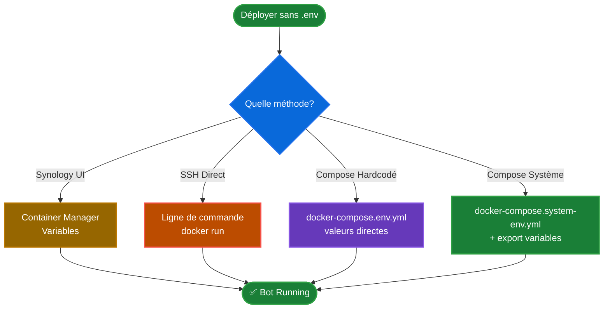

# 🔐 Déploiement sans fichier .env

Ce guide explique comment déployer le bot **sans fichier .env**, en utilisant des variables d'environnement.

## 🎯 Pourquoi éviter le fichier .env ?

- ✅ Meilleure sécurité (pas de fichier avec secrets en clair)
- ✅ Compatible avec les systèmes de secrets (Docker Secrets, Kubernetes)
- ✅ Plus flexible pour les environnements CI/CD
- ✅ Évite les problèmes de permissions fichier

---

## 📋 Méthodes Disponibles



---

## 🏠 Méthode 1 : Via Container Manager Synology (Recommandé)

### Interface Web

1. **Container Manager** → **Project** → **Create**
2. **Nom** : `discord-plateau-bot`
3. **Source** : Télécharger `docker-compose.system-env.yml`
4. **Variables d'environnement** :
   - Cliquer sur **Add Environment Variable**
   - Ajouter chaque variable :
     ```
     DISCORD_TOKEN = votre_token_bot
     GUILD_ID = votre_guild_id
     FORUM_CHANNEL_ID = votre_forum_channel_id
     REGISTRATION_URL = https://votre-lien.com
     TIMEZONE = Europe/Paris
     ```
5. **Build** → Le bot démarre avec les variables de l'interface

### Avantages
- ✅ Pas de fichier .env à gérer
- ✅ Variables chiffrées dans Container Manager
- ✅ Modification via l'interface web
- ✅ Sauvegarde automatique dans la configuration du projet

---

## 💻 Méthode 2 : Ligne de commande directe

### Via docker run

```bash
docker run -d \
  --name discord-plateau-bot \
  --restart unless-stopped \
  -e DISCORD_TOKEN="votre_token_bot" \
  -e GUILD_ID="votre_guild_id" \
  -e FORUM_CHANNEL_ID="votre_forum_channel_id" \
  -e REGISTRATION_URL="https://votre-lien.com" \
  -e TIMEZONE="Europe/Paris" \
  ghcr.io/kiwi41/discord-plateau-bot:latest
```

### Via docker-compose avec valeurs directes

```bash
# 1. Éditer docker-compose.env.yml avec vos vraies valeurs
nano docker-compose.env.yml

# 2. Démarrer
docker compose -f docker-compose.env.yml up -d

# 3. Vérifier
docker compose -f docker-compose.env.yml logs -f discord-bot
```

---

## 🔧 Méthode 3 : Variables système + docker-compose

### Configuration

```bash
# 1. Définir les variables dans votre shell
export DISCORD_TOKEN='votre_token_bot'
export GUILD_ID='votre_guild_id'
export FORUM_CHANNEL_ID='votre_forum_channel_id'
export REGISTRATION_URL='https://votre-lien-inscription.com'
export EVENT_ID='votre_event_id_optionnel'
export TIMEZONE='Europe/Paris'

# 2. Lancer avec le script helper
./deploy-no-env.sh

# OU directement avec docker-compose
docker compose -f docker-compose.system-env.yml up -d
```

### Rendre les variables persistantes

**Sur NAS Synology (SSH)** :

```bash
# Ajouter au fichier ~/.bashrc ou ~/.zshrc
nano ~/.bashrc

# Ajouter à la fin :
export DISCORD_TOKEN='votre_token_bot'
export GUILD_ID='votre_guild_id'
export FORUM_CHANNEL_ID='votre_forum_channel_id'
export REGISTRATION_URL='https://votre-lien.com'
export TIMEZONE='Europe/Paris'

# Recharger
source ~/.bashrc
```

---

## 🔐 Méthode 4 : Fichier de secrets externe

```bash
# 1. Créer un fichier de secrets en dehors du projet
sudo mkdir -p /volume1/secrets
sudo nano /volume1/secrets/discord-bot.env

# Contenu :
DISCORD_TOKEN=votre_token_bot
GUILD_ID=votre_guild_id
FORUM_CHANNEL_ID=votre_forum_channel_id
REGISTRATION_URL=https://votre-lien.com
TIMEZONE=Europe/Paris

# 2. Charger les variables et lancer
set -a
source /volume1/secrets/discord-bot.env
set +a
docker compose -f docker-compose.system-env.yml up -d
```

---

## 📊 Comparaison des Méthodes

| Méthode | Sécurité | Facilité | Persistance | Recommandé pour |
|---------|----------|----------|-------------|-----------------|
| **Container Manager UI** | ⭐⭐⭐⭐⭐ | ⭐⭐⭐⭐⭐ | ✅ Oui | Synology NAS |
| **docker run -e** | ⭐⭐⭐ | ⭐⭐⭐ | ❌ Non | Tests rapides |
| **compose hardcodé** | ⭐⭐ | ⭐⭐⭐⭐ | ✅ Oui | Dev local |
| **Variables système** | ⭐⭐⭐⭐ | ⭐⭐⭐ | ✅ Oui (avec bashrc) | SSH/Automation |
| **Fichier externe** | ⭐⭐⭐⭐⭐ | ⭐⭐⭐⭐ | ✅ Oui | Production |

---

## 🛡️ Bonnes Pratiques de Sécurité

### ✅ À FAIRE
- Utiliser Container Manager UI pour les NAS Synology
- Stocker les secrets dans des fichiers en dehors du projet Git
- Utiliser des permissions restrictives (`chmod 600`)
- Ne jamais commit de valeurs réelles dans docker-compose

### ❌ À NE PAS FAIRE
- Hardcoder les tokens dans des fichiers versionnés Git
- Laisser des fichiers de secrets lisibles par tous
- Afficher les tokens dans les logs (`echo $DISCORD_TOKEN`)

---

## 🔄 Migration depuis .env

```bash
# 1. Sauvegarder votre .env actuel
cp .env .env.backup

# 2. Exporter les variables
set -a
source .env
set +a

# 3. Vérifier
echo "Token: ${DISCORD_TOKEN:0:10}..."
echo "Guild ID: $GUILD_ID"

# 4. Lancer avec la nouvelle méthode
docker compose -f docker-compose.system-env.yml up -d

# 5. Une fois validé, supprimer .env
# rm .env .env.backup
```

---

## 📝 Scripts Helper Disponibles

```bash
# Déploiement avec variables système
./deploy-no-env.sh

# Afficher l'aide
./deploy-no-env.sh --help
```

---

## ❓ FAQ

**Q: Puis-je mélanger .env et variables système ?**
Oui, les variables système ont la priorité sur le fichier .env.

**Q: Comment voir les variables dans le container ?**
```bash
docker exec discord-plateau-bot env | grep DISCORD
```

**Q: Les variables persistent après un reboot du NAS ?**
Oui si configurées via Container Manager UI ou dans ~/.bashrc.

**Q: C'est plus sécurisé que .env ?**
Oui, surtout avec Container Manager UI qui chiffre les valeurs.

---

*📝 Guide complet pour déployer sans fichier .env sur NAS Synology et autres environnements*
