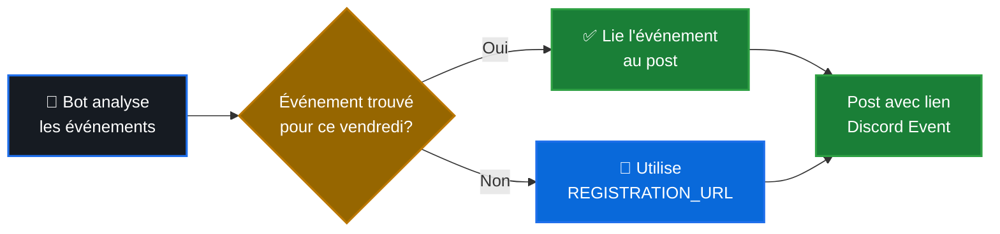

# 📅 Configuration des Événements Discord

Ce guide explique comment configurer les événements Discord pour qu'ils soient automatiquement liés aux posts de forum.

---

## 🎯 Fonctionnement

Le bot détecte automatiquement les événements Discord correspondant à chaque vendredi et les lie aux posts du forum. Cela permet aux membres de s'inscrire directement via Discord Events.



---

## ✅ Critères de Détection

Pour qu'un événement Discord soit automatiquement détecté et lié à un post, il doit répondre à **TOUS** ces critères :

### 1. Date de l'événement

L'événement doit être programmé **le vendredi ciblé** par le post.

**Exemples** :
- Post pour le vendredi 27 décembre → Événement du 27 décembre ✅
- Post pour le vendredi 27 décembre → Événement du 28 décembre ❌

### 2. Mots-clés dans le nom

Le nom de l'événement doit contenir **au moins un** de ces mots-clés (insensible à la casse) :

| Mot-clé | Exemples d'utilisation |
|---------|------------------------|
| `plateau` | Soirée **Plateaux**, **Plateau** du vendredi |
| `soirée` | **Soirée** jeux, **Soiree** conviviale |
| `jeu` | **Jeu**x de société, **Jeu** de plateau |
| `board` | **Board** game night, **Board** games |
| `game` | Board **game**, **Game** night |

---

## 📝 Exemples de Noms d'Événements

### ✅ Noms VALIDES (détectés)

```
✅ Soirée Plateaux
✅ Jeux de plateau
✅ Board Game Night
✅ Soirée jeu conviviale
✅ Plateau du vendredi
✅ Game Night - Vendredi
✅ 🎲 Soirée Jeux 🎲
✅ PLATEAU MENSUEL
✅ soirée plateaux (minuscules OK)
```

### ❌ Noms INVALIDES (ignorés)

```
❌ Réunion mensuelle          (pas de mot-clé)
❌ Cinéma du vendredi         (pas de mot-clé)
❌ Apéro Discord              (pas de mot-clé)
❌ Event test                 (pas de mot-clé)
❌ Vendredi soir              (pas de mot-clé)
```

---

## 🛠️ Configuration dans Discord

### Créer un Événement

1. **Ouvrir Discord** → Votre serveur
2. **Cliquer sur "Événements"** (en haut du serveur)
3. **"Créer un événement"**

### Paramètres Recommandés

```yaml
Nom: "Soirée Plateaux"
Lieu: Votre adresse ou "Externe"
Date de début: Vendredi 18:00
Date de fin: Vendredi 23:00
Description: "Rejoignez-nous pour une soirée jeux de plateau !"
Image de couverture: (optionnel)
```

### Événement Récurrent

Pour créer un événement qui se répète chaque vendredi :

1. Créer le premier événement
2. Noter son **Event ID** (dans l'URL)
3. Ajouter `EVENT_ID=votre_id` dans le fichier `.env`
4. Le bot utilisera cet événement comme référence

**Obtenir l'Event ID** :
```
URL de l'événement: https://discord.com/events/GUILD_ID/EVENT_ID
                                                          ^^^^^^^^^
                                                          Copier cet ID
```

---

## 🔍 Vérification et Debug

### Voir les événements détectés

```bash
# Dans les logs du bot
docker compose logs discord-bot | grep "événements"

# Exemple de sortie :
# 🔍 Recherche d'événements pour 2025-12-27...
# 📅 Recherche dans 3 événements
# ✅ Événement trouvé: Soirée Plateaux (2025-12-27)
```

### Si l'événement n'est pas détecté

**Checklist** :
1. ☑️ L'événement est bien programmé le vendredi ciblé ?
2. ☑️ Le nom contient un mot-clé (`plateau`, `soirée`, `jeu`, `board`, `game`) ?
3. ☑️ Le bot a les permissions pour voir les événements du serveur ?
4. ☑️ L'événement est "Publié" (pas en brouillon) ?

**Tester manuellement** :
```bash
# Vérifier que le bot voit les événements
# Les logs affichent le nombre d'événements trouvés
docker compose logs discord-bot --tail=100 | grep "événements"
```

---

## 🔄 Comportement de Secours

### Si aucun événement n'est trouvé

Le bot créera quand même le post de forum mais utilisera le **lien d'inscription alternatif** configuré dans `REGISTRATION_URL` au lieu d'un lien Discord Event.

**Configuration** :
```bash
# Dans .env
REGISTRATION_URL=https://votre-formulaire-inscription.com
```

Le post contiendra alors :
```
📝 Inscription : https://votre-formulaire-inscription.com
```

Au lieu de :
```
📝 Inscription : [Lien Discord Event]
```

---

## 📊 Permissions Requises

Le bot nécessite ces permissions Discord pour détecter les événements :

```yaml
Permissions Bot:
  ✅ View Events (Voir les événements)
  ✅ Manage Events (Gérer les événements) - optionnel
  ✅ Create Public Threads (Créer des posts publics)
  ✅ Send Messages in Threads
  ✅ Embed Links
```

**Vérifier les permissions** :
1. Paramètres du serveur → Rôles
2. Sélectionner le rôle du bot
3. Vérifier que "Voir les événements" est activé

---

## 💡 Bonnes Pratiques

### Pour une détection optimale

1. **Nommage cohérent** : Utilisez toujours le même format
   - Exemple : "Soirée Plateaux - [Date]"

2. **Créer à l'avance** : Créez les événements au moins 24h avant
   - Le bot s'exécute le samedi à 3h00

3. **Événement récurrent** : Configurez `EVENT_ID` pour automatiser
   - Un seul événement, références multiples

4. **Tester** : Utilisez `!create-plateau-post` pour tester manuellement
   - Vérifiez la détection avant l'exécution automatique

### Templates recommandés

**Simple** :
```
Soirée Plateaux
```

**Avec date** :
```
Soirée Plateaux - 27 Décembre
```

**Descriptif** :
```
🎲 Soirée Jeux de Plateau 🎲
```

**Bilingue** :
```
Soirée Plateaux / Board Game Night
```

---

## 🐛 Dépannage

### L'événement existe mais n'est pas détecté

1. **Vérifier le nom** :
   ```bash
   # Le nom contient-il un mot-clé ?
   echo "Soirée Cinéma" | grep -iE "plateau|soirée|jeu|board|game"
   # Pas de résultat = mot-clé manquant
   ```

2. **Vérifier la date** :
   - L'événement est exactement le même jour que le post ?
   - Format attendu : même date (ignorer l'heure)

3. **Vérifier les permissions** :
   ```bash
   # Dans les logs
   docker compose logs discord-bot | grep "événements disponibles"
   # Si 0 événements → problème de permissions
   ```

### Le bot ne voit aucun événement

```bash
# Symptôme dans les logs :
# ⚠️  Aucun événement disponible, utilisation des valeurs par défaut

# Solutions :
1. Vérifier les permissions du bot (View Events)
2. Vérifier qu'il y a bien des événements publiés
3. Redémarrer le bot après changement de permissions
```

---

## 📖 Exemples Complets

### Scénario 1 : Événement automatique détecté

**Configuration Discord** :
```
Nom: Soirée Plateaux
Date: Vendredi 27 Décembre 2024 18:00
```

**Résultat** :
```
✅ Le bot crée le post "Soirée Plateaux - Vendredi 27 Décembre 2024"
✅ Le post contient le lien vers l'événement Discord
✅ Les membres s'inscrivent via Discord Events
```

### Scénario 2 : Pas d'événement, utilise REGISTRATION_URL

**Configuration** :
```bash
# Pas d'événement créé dans Discord
# .env contient:
REGISTRATION_URL=https://forms.google.com/plateau-inscription
```

**Résultat** :
```
✅ Le bot crée le post "Soirée Plateaux - Vendredi 27 Décembre 2024"
📝 Le post contient le lien https://forms.google.com/plateau-inscription
```

### Scénario 3 : Événement récurrent

**Configuration** :
```bash
# .env
EVENT_ID=123456789012345678

# Discord : Un seul événement récurrent "Soirée Plateaux"
```

**Résultat** :
```
✅ Tous les posts pointent vers le même événement récurrent
✅ Simplifie la gestion (un seul événement à maintenir)
```

---

## 📞 Support

Si vous rencontrez des problèmes :

1. **Vérifier les logs** : `docker compose logs discord-bot`
2. **Tester manuellement** : `!create-plateau-post`
3. **Ouvrir une issue** : [GitHub Issues](https://github.com/Kiwi41/discord-plateau-bot/issues)

---

*📝 Dernière mise à jour : Décembre 2024*
*🤖 Configuration optimale pour la détection automatique des événements Discord*
