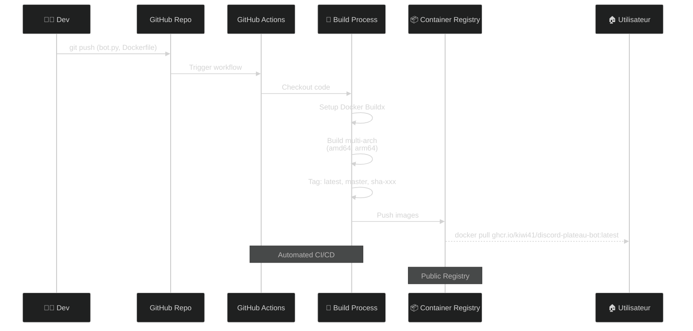
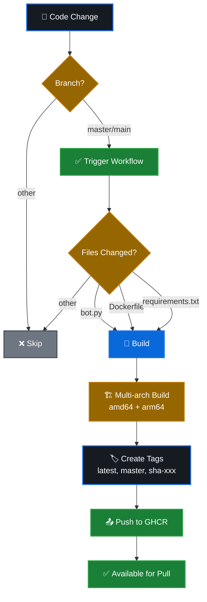
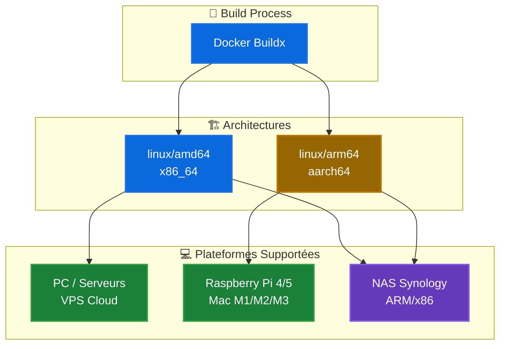

# 🐳 Publication Docker sur GitHub Container Registry

Le bot Python est automatiquement publié sur GitHub Container Registry (ghcr.io) via GitHub Actions.

## � Workflow de Publication



## �📦 Image disponible

```bash
ghcr.io/VOTRE_USERNAME/discord-python:latest
```

## 🚀 Utilisation de l'image publiée

### Option 1: Docker Compose (Recommandé)

```bash
# Télécharger le fichier compose
wget https://raw.githubusercontent.com/VOTRE_USERNAME/discord-plateau-bot/main/docker-compose.prod.python.yml

# Configurer .env
cp .env.example.python .env
# Éditer .env avec vos tokens

# Lancer
docker compose -f docker-compose.prod.python.yml up -d
```

### Option 2: Docker run direct

```bash
docker run -d \
  --name discord-plateau-bot-python \
  --restart unless-stopped \
  -e DISCORD_TOKEN="votre_token" \
  -e GUILD_ID="votre_guild_id" \
  -e FORUM_CHANNEL_ID="votre_forum_id" \
  -e REGISTRATION_URL="https://votre-lien.com" \
  -e TIMEZONE="Europe/Paris" \
  ghcr.io/VOTRE_USERNAME/discord-python:latest
```

## 🔧 Configuration GitHub

### 1. Activer GitHub Container Registry

Le workflow utilise `GITHUB_TOKEN` automatique, aucune configuration supplémentaire n'est nécessaire.

### 2. Rendre l'image publique (optionnel)

1. Aller sur https://github.com/VOTRE_USERNAME?tab=packages
2. Cliquer sur votre package `discord-python`
3. Aller dans **Package settings**
4. Descendre jusqu'à **Danger Zone**
5. Cliquer sur **Change visibility** → **Public**

## 🔄 Déploiement automatique



L'image est automatiquement buildée et publiée quand :

✅ Push sur la branche `main` ou `master`
✅ Modification de `bot.py`, `requirements.txt` ou `Dockerfile`
✅ Déclenchement manuel via GitHub Actions

## 🏷️ Tags disponibles

- `latest` : Dernière version de la branche principale
- `main` ou `master` : Version de la branche correspondante
- `sha-XXXXXXX` : Version spécifique par commit
- `v1.0.0` : Version sémantique (si tags git créés)

## 📥 Pull de l'image

```bash
# Pull de la dernière version
docker pull ghcr.io/VOTRE_USERNAME/discord-python:latest

# Pull d'une version spécifique
docker pull ghcr.io/VOTRE_USERNAME/discord-python:main
docker pull ghcr.io/VOTRE_USERNAME/discord-python:sha-abc1234
```

## 🔐 Authentification (pour images privées)

Si votre image est privée, authentifiez-vous d'abord :

```bash
# Créer un Personal Access Token avec scope 'read:packages'
# https://github.com/settings/tokens

# Login
echo "YOUR_PAT" | docker login ghcr.io -u USERNAME --password-stdin

# Puis pull
docker pull ghcr.io/VOTRE_USERNAME/discord-python:latest
```

## 📊 Multi-architecture



L'image est buildée pour :
- `linux/amd64` (x86_64) - PC, serveurs, la plupart des VPS
- `linux/arm64` (aarch64) - Raspberry Pi 4/5, Mac M1/M2/M3, certains NAS

Docker sélectionne automatiquement la bonne architecture.

## 🔍 Vérifier l'image

```bash
# Voir les tags disponibles
docker images | grep discord-python

# Inspecter l'image
docker inspect ghcr.io/VOTRE_USERNAME/discord-python:latest

# Voir l'historique
docker history ghcr.io/VOTRE_USERNAME/discord-python:latest
```

## 🆕 Mettre à jour

```bash
# Pull de la dernière version
docker compose -f docker-compose.prod.python.yml pull

# Redémarrer avec la nouvelle version
docker compose -f docker-compose.prod.python.yml up -d
```

## 🐛 Dépannage

### Erreur d'authentification

```bash
# Vérifier que vous êtes bien connecté
docker logout ghcr.io
echo "YOUR_PAT" | docker login ghcr.io -u USERNAME --password-stdin
```

### Image not found

- Vérifier que le workflow GitHub Actions s'est bien exécuté
- Vérifier le nom du repository dans l'URL
- Si l'image est privée, vérifier l'authentification

### Erreur de plateforme

```bash
# Forcer une plateforme spécifique
docker pull --platform linux/amd64 ghcr.io/VOTRE_USERNAME/discord-python:latest
```
