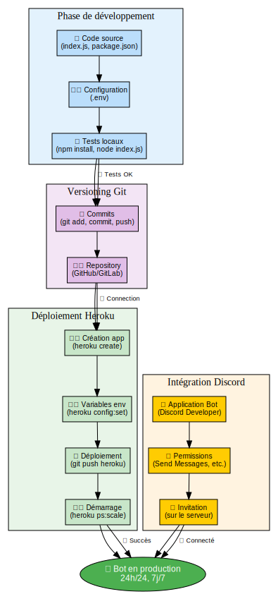
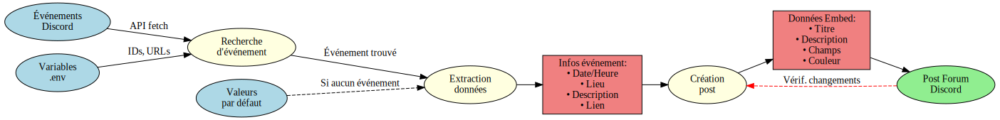
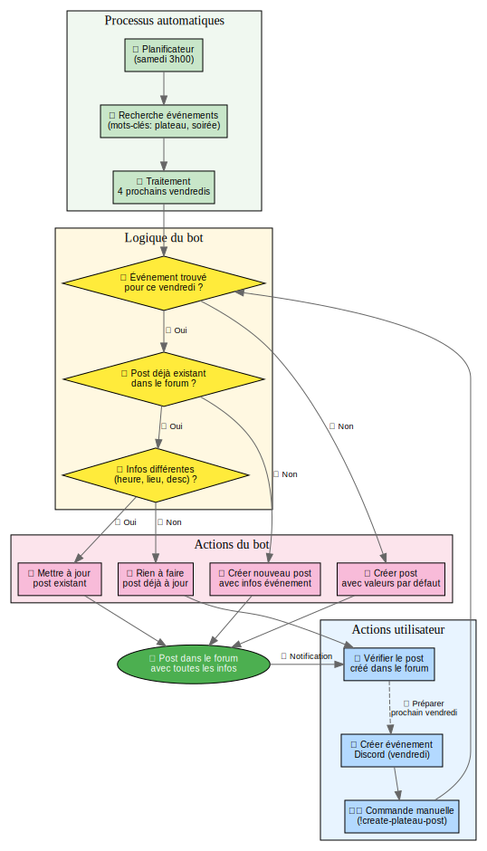
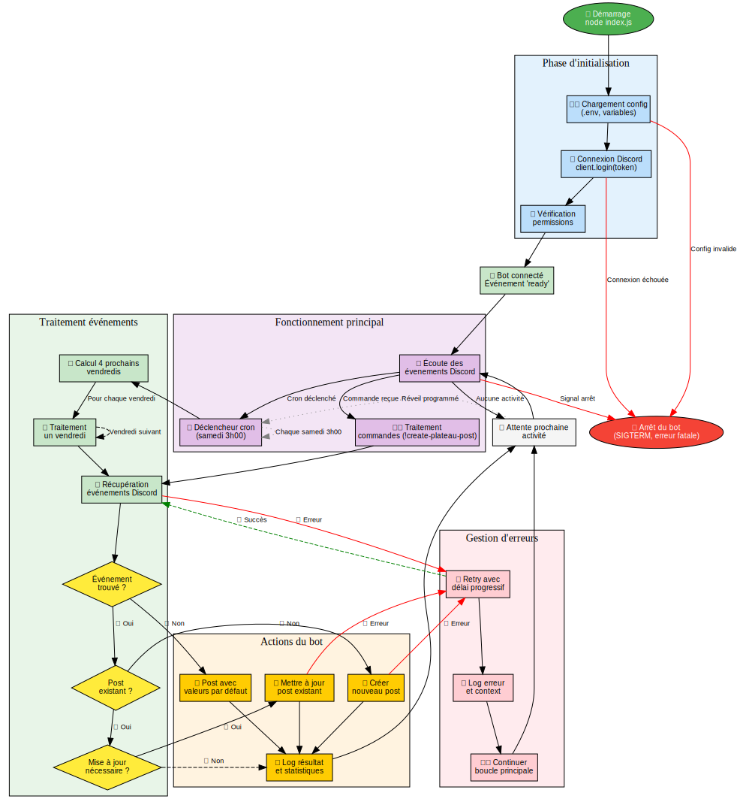

# 🎲 Bot Discord - Soirées Plateaux

Bot Discord intelligent qui crée et met à jour automatiquement des posts dans un forum pour planifier les soirées plateaux du vendredi soir.

<a href="docs/README.md">
<svg width="600" height="300" xmlns="http://www.w3.org/2000/svg">
  <defs>
    <marker id="arrowhead" markerWidth="10" markerHeight="7" 
            refX="9" refY="3.5" orient="auto">
      <polygon points="0 0, 10 3.5, 0 7" fill="#666" />
    </marker>
  </defs>
  
  <!-- Titre -->
  <text x="300" y="25" font="bold 16px sans-serif" text-anchor="middle">🎲 Bot Discord Plateaux - Architecture</text>
  
  <!-- Discord -->
  <rect x="20" y="50" width="120" height="80" fill="#e3f2fd" stroke="#1976d2" stroke-width="2" rx="8"/>
  <text x="80" y="75" font="12px sans-serif" text-anchor="middle">🎮 Discord</text>
  <text x="80" y="90" font="12px sans-serif" text-anchor="middle">Serveur</text>
  <text x="80" y="105" font="12px sans-serif" text-anchor="middle">Forum</text>
  <text x="80" y="120" font="12px sans-serif" text-anchor="middle">Événements</text>
  
  <!-- Bot Heroku -->
  <rect x="240" y="50" width="120" height="80" fill="#fff3e0" stroke="#f57c00" stroke-width="2" rx="12"/>
  <text x="300" y="75" font="12px sans-serif" text-anchor="middle">☁️ Heroku</text>
  <text x="300" y="90" font="12px sans-serif" text-anchor="middle">Bot Node.js</text>
  <text x="300" y="105" font="12px sans-serif" text-anchor="middle">24h/24</text>
  <text x="300" y="120" font="12px sans-serif" text-anchor="middle">Cron jobs</text>
  
  <!-- Utilisateurs -->
  <rect x="460" y="50" width="120" height="80" fill="#e8f5e8" stroke="#388e3c" stroke-width="2" rx="8"/>
  <text x="520" y="75" font="12px sans-serif" text-anchor="middle">👥 Utilisateurs</text>
  <text x="520" y="90" font="12px sans-serif" text-anchor="middle">Posts Forum</text>
  <text x="520" y="105" font="12px sans-serif" text-anchor="middle">Soirées</text>
  <text x="520" y="120" font="12px sans-serif" text-anchor="middle">Plateaux</text>
  
  <!-- Processus -->
  <rect x="130" y="180" width="340" height="80" fill="#f3e5f5" stroke="#7b1fa2" stroke-width="2" rx="8"/>
  <text x="300" y="200" font="12px sans-serif" text-anchor="middle">🔄 Processus automatique</text>
  <text x="300" y="215" font="12px sans-serif" text-anchor="middle">1. Récupération événements Discord</text>
  <text x="300" y="230" font="12px sans-serif" text-anchor="middle">2. Traitement 4 prochains vendredis</text>
  <text x="300" y="245" font="12px sans-serif" text-anchor="middle">3. Création/Mise à jour posts forum</text>
  
  <!-- Flèches -->
  <line x1="140" y1="90" x2="240" y2="90" stroke="#666" stroke-width="2" marker-end="url(#arrowhead)"/>
  <text x="190" y="85" font="10px sans-serif" text-anchor="middle">API Discord</text>
  
  <line x1="360" y1="90" x2="460" y2="90" stroke="#666" stroke-width="2" marker-end="url(#arrowhead)"/>
  <text x="410" y="85" font="10px sans-serif" text-anchor="middle">Posts</text>
  
  <line x1="300" y1="130" x2="300" y2="180" stroke="#666" stroke-width="2" marker-end="url(#arrowhead)"/>
  <text x="320" y="155" font="10px sans-serif" text-anchor="middle">Samedi 3h</text>
</svg>
</a>

*👆 Cliquez sur le diagramme pour accéder à la documentation complète*

## 📋 Démarrage rapide

### 🎯 Installation en 15 minutes
👉 **[Guide d'installation rapide](docs/guides/QUICK_INSTALL.md)** - Pour débutants complets

### 📚 Documentation complète  
👉 **[Documentation détaillée](docs/README.md)** - Guide complet avec diagrammes

### 🗂️ Index de la documentation
👉 **[Index général](docs/guides/INDEX.md)** - Navigation dans toute la documentation

### ❓ Problèmes ?
👉 **[FAQ](docs/guides/FAQ.md)** - Réponses aux questions fréquentes

### 📁 Structure du projet
👉 **[Arborescence organisée](PROJECT_STRUCTURE.md)** - Organisation des fichiers et scripts

---

## 📖 Navigation rapide

|  |  |
|:---:|:---:|
|  |  |
|  |  |

## 🎨 Diagrammes du système

<table>
<tr>
<td align="center" width="20%">
<a href="docs/README.md">

 <b>🏗️ Architecture</b>
</a>
</td>
<td align="center" width="20%">
<a href="docs/README.md#processus-de-déploiement">

 <b>🚀 Déploiement</b>
</a>
</td>
<td align="center" width="20%">
<a href="docs/README.md#flux-des-données">

 <b>📊 Flux de données</b>
</a>
</td>
<td align="center" width="20%">
<a href="docs/guides/FAQ.md">

 <b>🎮 Workflow</b>
</a>
</td>
<td align="center" width="20%">
<a href="docs/guides/FAQ.md#--comment-fonctionne-le-cycle-de-vie-du-bot-">

 <b>🔄 Cycle de vie</b>
</a>
</td>
</tr>
</table>

## ✨ Fonctionnalités principales

### 🤖 **Automatisation intelligente**
- ✅ **Planification automatique** : Posts créés chaque samedi à 3h00 du matin
- 🔄 **Mise à jour en temps réel** : Détecte les changements dans les événements Discord
- 📅 **Traitement des 4 prochains vendredis** : Plus pratique qu'un mois entier
- 🛡️ **Protection anti-doublon** : Évite les posts multiples

### 🎯 **Intégration Discord native**
- 📅 **Événements Discord** : Récupère automatiquement date, heure, lieu
- 📍 **Lieux intelligents** : Support physique, salons vocaux, scènes  
- 🔗 **Liens directs** : Vers l'événement Discord spécifique
- 📝 **Descriptions dynamiques** : Utilise le contenu des événements

### 🎨 **Interface soignée**
- 💎 **Embeds Discord élégants** : Messages avec mise en forme
- 🌍 **Fuseaux horaires** : Affichage correct selon votre région
- 🎲 **Thème plateaux** : Émojis et couleurs adaptés

## 🔄 Fonctionnement technique

<a href="docs/FAQ.md#--comment-fonctionne-le-cycle-de-vie-du-bot-">
<svg width="500" height="350" xmlns="http://www.w3.org/2000/svg">
  <defs>
    <marker id="arrowhead2" markerWidth="8" markerHeight="6" 
            refX="7" refY="3" orient="auto">
      <polygon points="0 0, 8 3, 0 6" fill="#666" />
    </marker>
  </defs>
  
  <!-- Titre -->
  <text x="250" y="20" font="bold 14px sans-serif" text-anchor="middle">🔄 Cycle de vie du bot Discord</text>
  
  <!-- Démarrage -->
  <ellipse cx="250" cy="50" rx="60" ry="20" fill="#4caf50" stroke="#388e3c" stroke-width="2"/>
  <text x="250" y="47" font="11px sans-serif" text-anchor="middle" fill="white">🚀 Démarrage</text>
  <text x="250" y="57" font="9px sans-serif" text-anchor="middle" fill="white">node index.js</text>
  
  <!-- Initialisation -->
  <rect x="180" y="80" width="140" height="40" fill="#e3f2fd" stroke="#1976d2" stroke-width="2" rx="8"/>
  <text x="250" y="97" font="11px sans-serif" text-anchor="middle">⚙️ Initialisation</text>
  <text x="250" y="107" font="9px sans-serif" text-anchor="middle">Config + Discord + Permissions</text>
  
  <!-- Bot connecté -->
  <rect x="180" y="140" width="140" height="30" fill="#e8f5e8" stroke="#388e3c" stroke-width="2" rx="8"/>
  <text x="250" y="157" font="11px sans-serif" text-anchor="middle">✅ Bot connecté et prêt</text>
  
  <!-- Boucle principale -->
  <rect x="50" y="200" width="100" height="40" fill="#e3f2fd" stroke="#1976d2" stroke-width="2" rx="8"/>
  <text x="100" y="217" font="11px sans-serif" text-anchor="middle">👂 Écoute</text>
  <text x="100" y="227" font="9px sans-serif" text-anchor="middle">Commandes/Cron</text>
  
  <!-- Traitement -->
  <rect x="200" y="200" width="100" height="40" fill="#e8f5e8" stroke="#388e3c" stroke-width="2" rx="8"/>
  <text x="250" y="217" font="11px sans-serif" text-anchor="middle">📋 Traitement</text>
  <text x="250" y="227" font="9px sans-serif" text-anchor="middle">Événements</text>
  
  <!-- Posts forum -->
  <rect x="350" y="200" width="100" height="40" fill="#fff3e0" stroke="#f57c00" stroke-width="2" rx="8"/>
  <text x="400" y="217" font="11px sans-serif" text-anchor="middle">📝 Posts</text>
  <text x="400" y="227" font="9px sans-serif" text-anchor="middle">Forum Discord</text>
  
  <!-- Attente -->
  <rect x="175" y="280" width="150" height="40" fill="#f5f5f5" stroke="#9e9e9e" stroke-width="2" rx="8"/>
  <text x="250" y="297" font="11px sans-serif" text-anchor="middle">😴 Attente prochain samedi</text>
  <text x="250" y="307" font="9px sans-serif" text-anchor="middle">• Cron: samedi 3h00</text>
  
  <!-- Flèches -->
  <line x1="250" y1="70" x2="250" y2="80" stroke="#666" stroke-width="2" marker-end="url(#arrowhead2)"/>
  <line x1="250" y1="120" x2="250" y2="140" stroke="#666" stroke-width="2" marker-end="url(#arrowhead2)"/>
  <line x1="200" y1="170" x2="120" y2="200" stroke="#666" stroke-width="2" marker-end="url(#arrowhead2)"/>
  <line x1="150" y1="220" x2="200" y2="220" stroke="#666" stroke-width="2" marker-end="url(#arrowhead2)"/>
  <line x1="300" y1="220" x2="350" y2="220" stroke="#666" stroke-width="2" marker-end="url(#arrowhead2)"/>
  <line x1="375" y1="240" x2="275" y2="280" stroke="#666" stroke-width="2" marker-end="url(#arrowhead2)"/>
  <line x1="180" y1="300" x2="120" y2="240" stroke="#666" stroke-width="2" marker-end="url(#arrowhead2)"/>
</svg>
</a>

*Cliquez sur le diagramme pour voir la documentation détaillée*

### Processus automatique

1. **🕐 Samedi 3h00** → Déclenchement automatique du cron job
2. **🔍 Récupération** → Fetch des événements Discord du serveur  
3. **📅 Filtrage** → Identification des 4 prochains vendredis
4. **🎯 Détection** → Recherche événements "plateau" ou "soirée"
5. **📝 Création/Mise à jour** → Posts forum avec toutes les infos
6. **✅ Vérification** → Anti-doublon et validation
7. **😴 Attente** → Jusqu'au prochain samedi

### Commandes manuelles

- `/create-plateau-post` - Crée un post pour un vendredi spécifique
- `/process-one-friday` - Traite un vendredi donné
- `!process-next-month` - Lance le traitement des 4 vendredis

## 🛠️ Technologies utilisées

- **Node.js** - Runtime JavaScript
- **discord.js v14** - Bibliothèque Discord
- **node-cron** - Planification automatique  
- **Heroku** - Hébergement cloud 24/7
- **Git** - Versioning et déploiement

## 📊 Statistiques du projet

## 🤝 Contribution et support

- **Issues** : [Créer un ticket](https://github.com/Kiwi41/discord-plateau-bot/issues)
- **Documentation** : [Guide complet](docs/README.md)
- **FAQ** : [Questions fréquentes](docs/guides/FAQ.md)
- **Structure** : [Organisation du projet](PROJECT_STRUCTURE.md)

## 📄 Licence et crédits

Projet open-source développé pour automatiser la gestion des soirées plateaux sur Discord.

---

**[🚀 Commencer maintenant](docs/guides/QUICK_INSTALL.md)** • **[📚 Documentation](docs/README.md)** • **[❓ Support](docs/guides/FAQ.md)**

