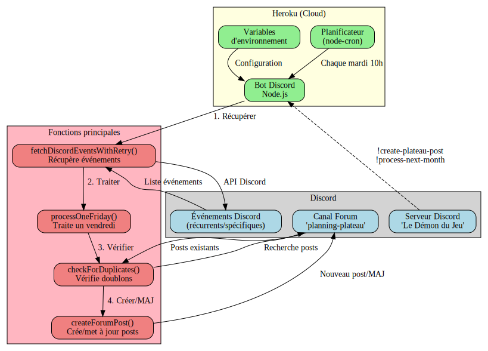
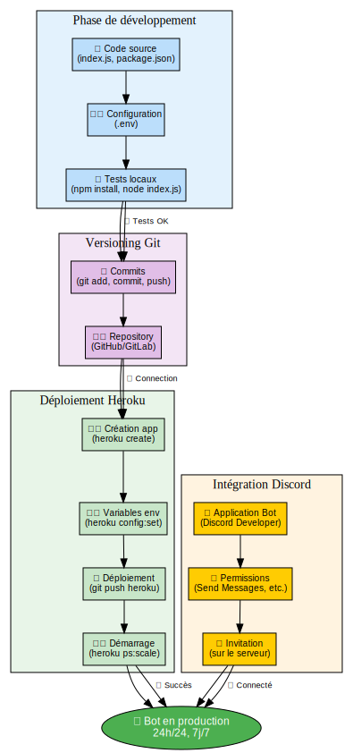
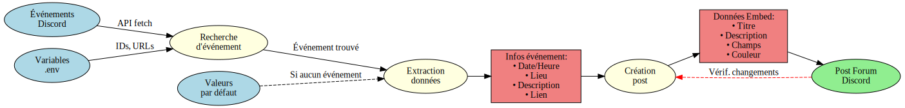
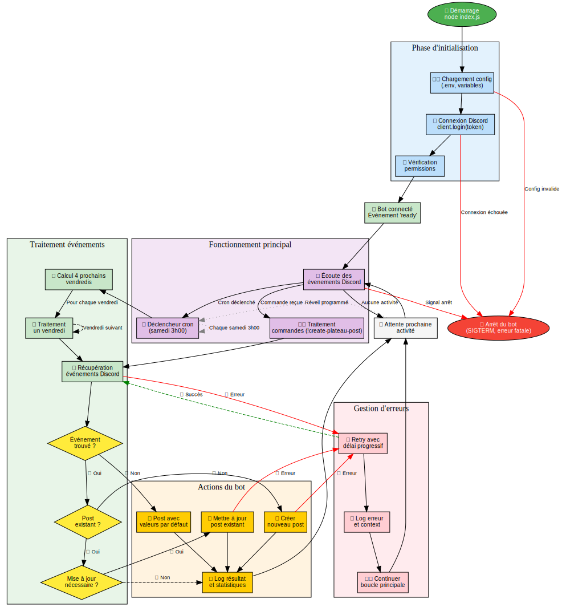

# 🎲 Bot Discord - Soirées Plateaux

Bot Discord intelligent qui crée et met à jour automatiquement des posts dans un forum pour planifier les soirées plateaux du vendredi soir.

<div align="center">

<a href="docs/README.md">
<svg width="600" height="300" xmlns="http://www.w3.org/2000/svg">
  <defs>
    <style>
      .title { font: bold 16px sans-serif; text-anchor: middle; }
      .label { font: 12px sans-serif; text-anchor: middle; }
      .box { fill: #e3f2fd; stroke: #1976d2; stroke-width: 2; rx: 8; }
      .cloud { fill: #fff3e0; stroke: #f57c00; stroke-width: 2; rx: 12; }
      .bot { fill: #e8f5e8; stroke: #388e3c; stroke-width: 2; rx: 8; }
      .arrow { stroke: #666; stroke-width: 2; marker-end: url(#arrowhead); }
    </style>
    <marker id="arrowhead" markerWidth="10" markerHeight="7" 
            refX="9" refY="3.5" orient="auto">
      <polygon points="0 0, 10 3.5, 0 7" fill="#666" />
    </marker>
  </defs>
  
  <!-- Titre -->
  <text x="300" y="25" class="title">🎲 Bot Discord Plateaux - Architecture</text>
  
  <!-- Discord -->
  <rect x="20" y="50" width="120" height="80" class="box"/>
  <text x="80" y="75" class="label">🎮 Discord</text>
  <text x="80" y="90" class="label">Serveur</text>
  <text x="80" y="105" class="label">Forum</text>
  <text x="80" y="120" class="label">Événements</text>
  
  <!-- Bot Heroku -->
  <rect x="240" y="50" width="120" height="80" class="cloud"/>
  <text x="300" y="75" class="label">☁️ Heroku</text>
  <text x="300" y="90" class="label">Bot Node.js</text>
  <text x="300" y="105" class="label">24h/24</text>
  <text x="300" y="120" class="label">Cron jobs</text>
  
  <!-- Utilisateurs -->
  <rect x="460" y="50" width="120" height="80" class="bot"/>
  <text x="520" y="75" class="label">👥 Utilisateurs</text>
  <text x="520" y="90" class="label">Posts Forum</text>
  <text x="520" y="105" class="label">Soirées</text>
  <text x="520" y="120" class="label">Plateaux</text>
  
  <!-- Processus -->
  <rect x="130" y="180" width="340" height="80" class="box" style="fill: #f3e5f5; stroke: #7b1fa2;"/>
  <text x="300" y="200" class="label">🔄 Processus automatique</text>
  <text x="300" y="215" class="label">1. Récupération événements Discord</text>
  <text x="300" y="230" class="label">2. Traitement 4 prochains vendredis</text>
  <text x="300" y="245" class="label">3. Création/Mise à jour posts forum</text>
  
  <!-- Flèches -->
  <line x1="140" y1="90" x2="240" y2="90" class="arrow"/>
  <text x="190" y="85" class="label" style="font-size: 10px;">API Discord</text>
  
  <line x1="360" y1="90" x2="460" y2="90" class="arrow"/>
  <text x="410" y="85" class="label" style="font-size: 10px;">Posts</text>
  
  <line x1="300" y1="130" x2="300" y2="180" class="arrow"/>
  <text x="320" y="155" class="label" style="font-size: 10px;">Samedi 3h</text>
</svg>
</a>

*👆 Cliquez sur le diagramme pour accéder à la documentation complète*

</div>

## � Démarrage rapide

### 🎯 Installation en 15 minutes
👉 **[Guide d'installation rapide](docs/QUICK_INSTALL.md)** - Pour débutants complets

### 📚 Documentation complète  
👉 **[Documentation détaillée](docs/README.md)** - Guide complet avec diagrammes

### 🗂️ Index de la documentation
👉 **[Index général](docs/INDEX.md)** - Navigation dans toute la documentation

### ❓ Problèmes ?
👉 **[FAQ](docs/FAQ.md)** - Réponses aux questions fréquentes

---

## 📖 Navigation rapide

<div align="center">

| [](docs/QUICK_INSTALL.md) | [](docs/README.md) |
|:---:|:---:|
| [](docs/FAQ.md) | [](docs/INDEX.md) |

### 🎨 Diagrammes détaillés

<table>
<tr>
<td align="center" width="20%">
<a href="docs/README.md">

<br><sub><b>🏗️ Architecture</b></sub>
</a>
</td>
<td align="center" width="20%">
<a href="docs/README.md#processus-de-déploiement">

<br><sub><b>🚀 Déploiement</b></sub>
</a>
</td>
<td align="center" width="20%">
<a href="docs/README.md#flux-des-données">

<br><sub><b>📊 Flux de données</b></sub>
</a>
</td>
<td align="center" width="20%">
<a href="docs/FAQ.md">

<br><sub><b>🎮 Workflow</b></sub>
</a>
</td>
<td align="center" width="20%">
<a href="docs/FAQ.md#--comment-fonctionne-le-cycle-de-vie-du-bot-">

<br><sub><b>🔄 Cycle de vie</b></sub>
</a>
</td>
</tr>
</table>

</div>

## ✨ Fonctionnalités principales

### 🤖 **Automatisation intelligente**
- ✅ **Planification automatique** : Posts créés chaque samedi à 3h00 du matin
- 🔄 **Mise à jour en temps réel** : Détecte les changements dans les événements Discord
- 📅 **Traitement des 4 prochains vendredis** : Plus pratique qu'un mois entier
- 🛡️ **Protection anti-doublon** : Évite les posts multiples

### 🎯 **Intégration Discord native**
- 📅 **Événements Discord** : Récupère automatiquement date, heure, lieu
- 📍 **Lieux intelligents** : Support physique, salons vocaux, scènes  
- 🔗 **Liens directs** : Vers l'événement Discord spécifique
- 📝 **Descriptions dynamiques** : Utilise le contenu des événements

### 🎨 **Interface soignée**
- 💎 **Embeds Discord élégants** : Messages avec mise en forme
- 🌍 **Fuseaux horaires** : Affichage correct selon votre région
- 🎲 **Thème plateaux** : Émojis et couleurs adaptés

## � Fonctionnement technique

<div align="center">

<a href="docs/FAQ.md#--comment-fonctionne-le-cycle-de-vie-du-bot-">
<svg width="500" height="350" xmlns="http://www.w3.org/2000/svg">
  <defs>
    <style>
      .title { font: bold 14px sans-serif; text-anchor: middle; }
      .label { font: 11px sans-serif; text-anchor: middle; }
      .small { font: 9px sans-serif; text-anchor: middle; }
      .start { fill: #4caf50; stroke: #388e3c; stroke-width: 2; }
      .process { fill: #e3f2fd; stroke: #1976d2; stroke-width: 2; rx: 8; }
      .decision { fill: #fff3e0; stroke: #f57c00; stroke-width: 2; }
      .action { fill: #e8f5e8; stroke: #388e3c; stroke-width: 2; rx: 8; }
      .error { fill: #ffebee; stroke: #f44336; stroke-width: 2; rx: 8; }
      .sleep { fill: #f5f5f5; stroke: #9e9e9e; stroke-width: 2; rx: 8; }
      .arrow { stroke: #666; stroke-width: 2; marker-end: url(#arrowhead); }
    </style>
    <marker id="arrowhead" markerWidth="8" markerHeight="6" 
            refX="7" refY="3" orient="auto">
      <polygon points="0 0, 8 3, 0 6" fill="#666" />
    </marker>
  </defs>
  
  <!-- Titre -->
  <text x="250" y="20" class="title">🔄 Cycle de vie du bot Discord</text>
  
  <!-- Démarrage -->
  <ellipse cx="250" cy="50" rx="60" ry="20" class="start"/>
  <text x="250" y="47" class="label" fill="white">🚀 Démarrage</text>
  <text x="250" y="57" class="small" fill="white">node index.js</text>
  
  <!-- Initialisation -->
  <rect x="180" y="80" width="140" height="40" class="process"/>
  <text x="250" y="97" class="label">⚙️ Initialisation</text>
  <text x="250" y="107" class="small">Config + Discord + Permissions</text>
  
  <!-- Bot connecté -->
  <rect x="180" y="140" width="140" height="30" class="action"/>
  <text x="250" y="157" class="label">✅ Bot connecté et prêt</text>
  
  <!-- Boucle principale -->
  <rect x="50" y="200" width="100" height="40" class="process"/>
  <text x="100" y="217" class="label">👂 Écoute</text>
  <text x="100" y="227" class="small">Commandes/Cron</text>
  
  <!-- Traitement -->
  <rect x="200" y="200" width="100" height="40" class="action"/>
  <text x="250" y="217" class="label">📋 Traitement</text>
  <text x="250" y="227" class="small">Événements</text>
  
  <!-- Gestion erreur -->
  <rect x="350" y="200" width="100" height="40" class="error"/>
  <text x="400" y="217" class="label">🛠️ Erreurs</text>
  <text x="400" y="227" class="small">Retry + Log</text>
  
  <!-- Attente -->
  <rect x="200" y="280" width="100" height="30" class="sleep"/>
  <text x="250" y="297" class="label">😴 Attente prochaine activité</text>
  
  <!-- Arrêt -->
  <ellipse cx="80" cy="320" rx="50" ry="20" class="error"/>
  <text x="80" y="317" class="small" fill="white">🛑 Arrêt</text>
  <text x="80" y="327" class="small" fill="white">(signal/erreur)</text>
  
  <!-- Flèches principales -->
  <line x1="250" y1="70" x2="250" y2="80" class="arrow"/>
  <line x1="250" y1="120" x2="250" y2="140" class="arrow"/>
  <line x1="250" y1="170" x2="100" y2="200" class="arrow"/>
  
  <!-- Boucle principale -->
  <line x1="150" y1="220" x2="200" y2="220" class="arrow"/>
  <text x="175" y="215" class="small">Activité</text>
  
  <!-- Vers traitement -->
  <line x1="300" y1="220" x2="350" y2="220" class="arrow"/>
  <text x="325" y="215" class="small">Erreur</text>
  
  <!-- Vers attente -->
  <line x1="250" y1="240" x2="250" y2="280" class="arrow"/>
  <line x1="400" y1="240" x2="250" y2="280" class="arrow"/>
  
  <!-- Retour boucle -->
  <path d="M 200,295 Q 150,300 120,270 Q 90,240 95,220" 
        fill="none" stroke="#666" stroke-width="2" marker-end="url(#arrowhead)"/>
  <text x="140" y="275" class="small">Réveil</text>
  
  <!-- Vers arrêt -->
  <line x1="150" y1="240" x2="80" y2="300" class="arrow" stroke="#f44336"/>
  <text x="105" y="275" class="small" fill="#f44336">Signal</text>
  
  <!-- Annotations temporelles -->
  <text x="360" y="50" class="small" fill="#666">• Démarrage: ~2-3 sec</text>
  <text x="360" y="65" class="small" fill="#666">• Cron: samedi 3h00</text>
  <text x="360" y="80" class="small" fill="#666">• Traitement: ~30 sec</text>
  <text x="360" y="95" class="small" fill="#666">• Retry: 2s → 4s → 6s</text>
</svg>
</a>

*👆 Cliquez pour voir les détails techniques du cycle de vie*

</div>

## �🛠️ Technologies utilisées

- **Node.js** ≥18.0.0 - Runtime JavaScript
- **discord.js** v14 - API Discord
- **node-cron** - Planification automatique  
- **Heroku** - Hébergement cloud 24h/24

## 🎮 Commandes disponibles

| Commande | Description | Permissions |
|----------|-------------|-------------|
| `!create-plateau-post` | Crée un post pour le prochain vendredi | Admins |
| `!process-next-month` | Traite les 4 prochains vendredis | Admins |
| `!plateau-help` | Affiche l'aide | Tous |

## 📦 Installation locale (développement)

```bash
# Cloner le projet
git clone https://github.com/ton-repo/discord-plateau-bot.git
cd discord-plateau-bot

# Installer les dépendances
npm install

# Configurer les variables d'environnement
cp .env.example .env
# Éditer .env avec tes valeurs

# Démarrer le bot
node index.js
```

## 🚀 Déploiement Heroku

```bash
# Créer l'application
heroku create mon-bot-plateaux

# Configurer les variables d'environnement
heroku config:set DISCORD_TOKEN=ton_token
heroku config:set GUILD_ID=ton_guild_id  
heroku config:set FORUM_CHANNEL_ID=ton_channel_id
heroku config:set REGISTRATION_URL=ton_url

# Déployer
git push heroku master
heroku ps:scale worker=1
```

## � Exemple de post généré


Le bot crée des posts comme celui-ci :

```
🎲 Soirée Plateaux du Vendredi ! 🎲

Venez découvrir et jouer à une grande variété de jeux de plateau 
dans une ambiance conviviale !

📅 Date: vendredi 10 octobre 2025
🕖 Heure: 20:30  
📍 Lieu: Le Cube en Bois
🎯 Événement Discord: [Rejoindre l'événement](https://discord.com/events/...)

[S'inscrire ici](https://framadate.org/...)
```

## 📋 Configuration requise

### Variables d'environnement
```bash
# Obligatoires
DISCORD_TOKEN=ton_token_bot_discord
GUILD_ID=id_de_ton_serveur  
FORUM_CHANNEL_ID=id_du_canal_forum
REGISTRATION_URL=https://ton-lien-inscription.com

# Optionnelles
TIMEZONE=Europe/Paris
EVENT_ID=id_evenement_recurrent_specifique
```

👉 **Voir [.env.example](.env.example) pour un exemple détaillé**

## 🔧 Dépannage rapide

### ❌ Bot ne répond pas
```bash
# Vérifier les logs
heroku logs --tail

# Redémarrer le bot  
heroku restart
```

### ❌ Posts avec valeurs par défaut
- ✅ Créer des événements Discord avec "plateau" dans le nom
- ✅ Mettre la date sur un vendredi futur
- ✅ Vérifier l'heure de l'événement

### ❌ Erreur de permissions
- ✅ Bot invité sur le serveur
- ✅ Permissions: Send Messages, Create Threads, Embed Links
- ✅ Canal forum accessible au bot

## � Monitoring

### Logs importants à surveiller
```bash
✅ Bot connecté en tant que...
✅ événements trouvés sur le serveur
✅ Post créé: Soirée Plateaux - vendredi...
⚠️ Aucun événement trouvé pour...
❌ Erreur lors de la création du post
```

### Commandes de diagnostic
```bash
heroku logs --tail          # Logs en temps réel
heroku ps                   # État du bot
heroku config               # Variables configurées
```

## 📅 Planification Automatique

Le bot traite automatiquement **tous les samedis à 3h00** du matin :
- � **Traitement des 4 prochains vendredis** : Plus pratique qu'un mois entier
- 🔄 **Mise à jour intelligente** : Met à jour les posts existants si les informations changent
- 🎯 **Détection automatique** : Trouve les événements Discord correspondant à chaque date

### 👑 Commandes Administrateur

Les administrateurs peuvent utiliser ces commandes dans le chat :

| Commande | Description |
|----------|-------------|
| `!create-plateau-post` | Crée ou met à jour le post pour le prochain vendredi uniquement |
| `!process-next-month` | Traite les 4 prochains vendredis (création + mise à jour) |
| `!plateau-help` | Affiche l'aide des commandes disponibles |

### ⚙️ Modifier la planification

Pour changer l'heure/jour de planification, modifiez cette ligne dans `index.js` :
```javascript
// Samedi 3h00 du matin (format cron: minute heure * * jour_semaine)
cron.schedule('0 3 * * 6', () => { ... });

// Exemples d'autres planifications :
// Lundi 9h00    : '0 9 * * 1'
// Mercredi 15h30 : '30 15 * * 3'  
// Vendredi 8h45  : '45 8 * * 5'
```

## 🧠 Fonctionnement Intelligent

### 📅 **Traitement des 4 Prochains Vendredis (Samedi 3h00)**

#### 🎯 **Pourquoi 4 vendredis plutôt qu'un mois entier ?**
- ✅ **Plus réactif** : Couvre toujours environ 1 mois glissant
- ✅ **Plus logique** : Pas de coupure artificielle en fin de mois
- ✅ **Plus pratique** : Traite exactement ce qui est nécessaire
- ✅ **Plus prévisible** : Toujours 4 dates, peu importe le mois

#### 🔄 **Processus de traitement :**
1. **🗓️ Calcul** → Détermine les 4 prochains vendredis à partir de maintenant
2. **🔍 Recherche** → Trouve les événements Discord correspondant à chaque date
3. **⚡ Traitement séquentiel** → Pour chaque vendredi :
   - 🆕 **Nouveau post** → Crée avec les informations de l'événement
   - 🔄 **Post existant** → Compare et met à jour si nécessaire  
   - ✅ **Déjà à jour** → Laisse inchangé
4. **📊 Résumé** → Statistiques détaillées (créés, mis à jour, inchangés, erreurs)

### 🎲 **Logique de Récupération Intelligente**
| Priorité | Source | Comportement |
|----------|--------|--------------|
| 🏆 **1** | Événement spécifique trouvé | Utilise toutes les informations exactes |
| 📅 **2** | Événement récurrent configuré | Adapte date, utilise heure/lieu de référence |
| 🔗 **3** | URL de fallback | Valeurs par défaut (19h00, lieu à définir) |

### 🔄 **Système de Mise à Jour Avancé**
- ✅ **Détection précise** : Compare heure, lieu, description
- 🎯 **Mise à jour ciblée** : Modifie uniquement ce qui a changé  
- 📝 **Logs explicites** : Indique exactement les changements effectués
- 🛡️ **Sécurité** : Ne touche que les messages du bot lui-même

## 🎨 Exemple de post généré

Le bot crée des posts riches avec toutes les informations extraites automatiquement :

```
🎲 Soirée Plateaux du Vendredi ! 🎲

Rejoignez-nous pour une soirée jeux de plateau conviviale !

📅 Date: vendredi 10 octobre 2025
🕖 Heure: 20:30  
📍 Lieu: 📍 [Le Cube en Bois](https://maps.google.com/...)
🎯 Événement Discord: [Rejoindre l'événement](https://discord.com/events/...)
```

### 🎯 **Adaptabilité intelligente :**
- **Événement spécifique trouvé** → Utilise ses informations exactes
- **Événement récurrent configuré** → Utilise ses paramètres par défaut  
- **Aucun événement** → Utilise l'URL d'inscription de fallback

### 📍 **Types de lieux supportés :**
- **🏢 Lieux physiques** : Affichage avec liens Google Maps cliquables
- **🔊 Salons vocaux** : Indication du salon Discord
- **🎪 Scènes Discord** : Pour les événements sur scène
- **⚙️ Personnalisé** : Tout texte configuré dans l'événement

## 🔧 Permissions Discord Requises

Le bot nécessite les permissions Discord suivantes:

### Permissions essentielles
- ✅ `Send Messages` - Envoyer des messages
- ✅ `Create Public Threads` - Créer des posts dans le forum  
- ✅ `Send Messages in Threads` - Poster dans les threads du forum
- ✅ `Embed Links` - Créer des embeds riches
- ✅ `Read Message History` - Lire l'historique pour les mises à jour

### Permissions pour les événements
- ✅ `View Guild Events` - Lire les événements du serveur
- ✅ `Manage Events` - Accéder aux détails des événements (optionnel)

### Invitation du bot
Utilisez ce template d'URL d'invitation (remplacez `YOUR_BOT_ID`) :
```
https://discord.com/api/oauth2/authorize?client_id=YOUR_BOT_ID&permissions=515396344896&scope=bot
```

## 📂 Structure du projet

```
Discord/
├── index.js                    # 🤖 Bot principal avec toutes les fonctionnalités
├── config.js                   # ⚙️ Classe de gestion de la configuration  
├── package.json                # 📦 Dépendances et scripts npm
├── .env.example               # 📋 Modèle de configuration
├── .env                       # 🔐 Configuration (à créer)
├── .gitignore                 # 🚫 Fichiers ignorés par git
├── README.md                  # 📖 Ce fichier de documentation
└── .github/
    └── copilot-instructions.md # 🛠️ Instructions pour GitHub Copilot
```

### 🧠 **Fonctions principales dans `index.js` :**

| Fonction | Description |
|----------|-------------|
| `getNextFriday()` | 📅 Calcule le prochain vendredi |
| `getNextFourFridays()` | � Obtient les 4 prochains vendredis |
| `findFridayEvent()` | 🔍 Cherche l'événement Discord correspondant |
| `processOneFriday()` | 🎯 Traite un vendredi (création/mise à jour) |
| `processNextFourFridays()` | 📊 Traite les 4 prochains vendredis |
| `updateExistingPost()` | 🔄 Met à jour un post existant |
| `checkForDuplicates()` | 🛡️ Vérifie les doublons |

## 🐛 Dépannage

### 🚫 Le bot ne se connecte pas
- ✅ Vérifiez que le `DISCORD_TOKEN` est correct dans le fichier `.env`
- ✅ Assurez-vous que le bot est invité sur le serveur avec les bonnes permissions
- ✅ Vérifiez que le token n'a pas expiré (régénérez-le si nécessaire)

### 📝 Les posts ne se créent pas
- ✅ Vérifiez que `FORUM_CHANNEL_ID` correspond bien à votre canal forum
- ✅ Assurez-vous que le bot a les permissions pour créer des threads
- ✅ Vérifiez que le canal est bien de type "Forum" et non "Texte"
- ✅ Consultez les logs dans la console pour les erreurs détaillées

### 📅 Les informations d'événement sont incorrectes
- ✅ Vérifiez que votre `EVENT_ID` est correct (événement récurrent)
- ✅ Assurez-vous que l'événement Discord contient les bonnes informations
- ✅ Activez les logs de debug temporairement pour diagnostiquer
- ✅ Vérifiez le timezone configuré dans `.env`

### ❌ Erreur "npm command not found"
- ✅ Installez Node.js depuis [nodejs.org](https://nodejs.org/)  
- ✅ Redémarrez votre terminal après l'installation
- ✅ Vérifiez avec `node --version` et `npm --version`

### 🔄 Les mises à jour ne fonctionnent pas
- ✅ Vérifiez que le bot a la permission `Read Message History`
- ✅ Assurez-vous que les messages à mettre à jour ont bien été créés par le bot
- ✅ Consultez les logs pour voir les comparaisons effectuées

### 📊 Logs et Diagnostic

Pour activer le debug détaillé, décommentez ces lignes dans `index.js` :
```javascript
// Debug: affichage des informations de l'événement
console.log(`🔍 Debug événement trouvé:`);
console.log(`   Nom: ${fridayEvent.name}`);
// ... autres logs de debug
```

## 🔮 Évolutions Futures

### 🚀 **Fonctionnalités envisagées :**
- 📊 **Dashboard web** : Interface de gestion via navigateur
- 🔔 **Notifications** : Rappels automatiques avant les événements  
- 📈 **Statistiques** : Suivi de la participation aux événements
- 🎯 **IA** : Suggestions automatiques de jeux selon les participants
- 🌐 **Multi-serveurs** : Support de plusieurs serveurs Discord

### ⚡ **Optimisations possibles :**
- 🗄️ **Base de données** : Stockage des historiques et préférences
- 🔄 **Webhooks** : Intégration avec d'autres services (Calendrier, etc.)
- 🎨 **Templates** : Messages personnalisables selon les événements

## 🤝 Contribution et Support

### 💡 **Personnalisation**
Ce bot est conçu pour être facilement adaptable :
- 🎯 Modifiez les messages dans les `EmbedBuilder`
- 📅 Changez la planification dans `cron.schedule`  
- 🔍 Adaptez la recherche d'événements dans `findFridayEvent`
- 🎨 Personnalisez les couleurs, émojis et textes

### 🆘 **Support**
- 📖 Consultez ce README pour la configuration
- 🔧 Activez les logs de debug pour diagnostiquer
- 🤖 Utilisez les commandes `!plateau-help` pour tester
- 📝 Vérifiez les permissions Discord requises

### 🌟 **Améliorations suggérées**
N'hésitez pas à adapter le bot selon vos besoins spécifiques :
- Ajouter d'autres types d'événements (soirées jeux vidéo, etc.)
- Intégrer avec d'autres bots ou services
- Personnaliser les messages selon votre communauté

## 📄 Licence

**MIT License** - Utilisez, modifiez et distribuez librement selon vos besoins.

---

<div align="center">

**🎲 Bot Soirées Plateaux - Automatisation intelligente pour votre communauté Discord 🎲**

*Développé avec ❤️ pour simplifier l'organisation de vos soirées jeux*

</div>