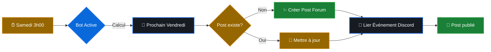
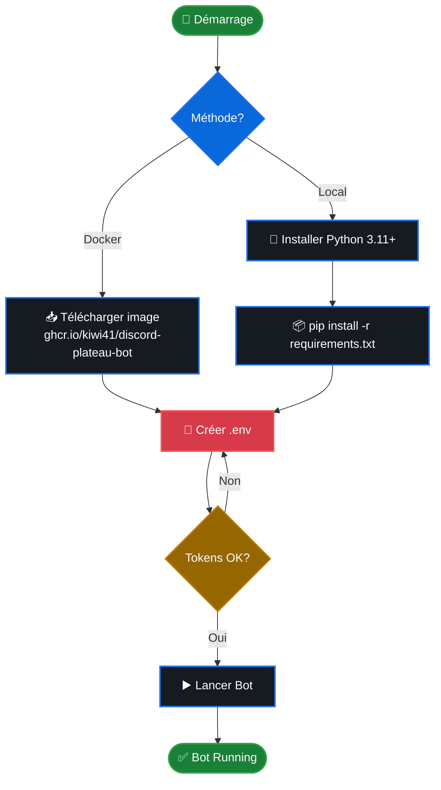
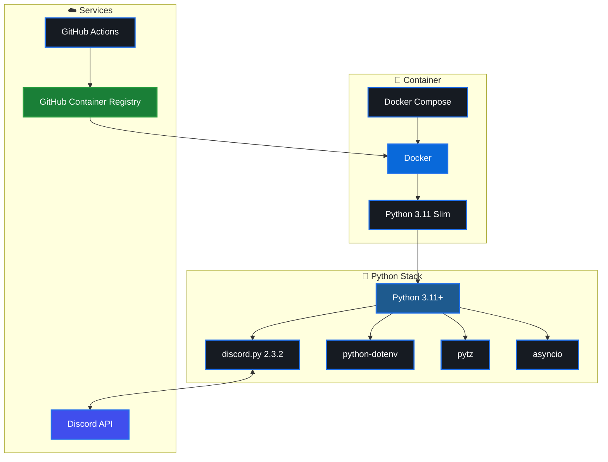

# 🎲 Discord Bot pour Soirées Plateaux - Version Python

Bot Discord automatisé qui crée des posts hebdomadaires dans un forum pour planifier les soirées jeux de plateau du vendredi soir.

## 🎯 Vue d'ensemble



## ✨ Fonctionnalités

- **📅 Création automatique** : Posts hebdomadaires chaque samedi à 3h00
- **🎯 Intégration forum** : Utilise les forums Discord natifs
- **🎉 Création automatique d'événements** : Crée des événements Discord individuels si aucun n'existe
- **🔗 Liens automatiques** : Vers les événements Discord et inscription
- **👥 Suivi des participant·e·s** : Mise à jour automatique des inscriptions toutes les 15 minutes
- **⚡ Commandes manuelles** : Création manuelle et gestion avancée (y compris traitement de vendredis spécifiques)
- **🐳 Docker** : Déploiement conteneurisé sur NAS, cloud ou local
- **🐍 Python 3.11+** : Code moderne et maintenable
- **♾️ Écriture inclusive** : Logs et messages avec termes épicènes (participant·e·s)
- **📊 Statistiques** : Suivi des participations, tendances et analyses

## 🚀 Installation Rapide+



### Option 1: Docker (Recommandé)

```bash
# Configurer l'environnement
cp .env.example.python .env
# Éditer .env avec vos tokens Discord

# Lancer avec Docker
docker compose -f docker-compose.python.yml up -d

# Voir les logs
docker compose -f docker-compose.python.yml logs -f
```

### Option 2: Python local

```bash
# Installer Python 3.11+ et pip

# Installer les dépendances
pip install -r requirements.txt

# Configurer l'environnement
cp .env.example.python .env
# Éditer .env avec vos tokens Discord

# Démarrer le bot
python bot.py
```

## ⚙️ Configuration

### Variables d'environnement requises

Créer un fichier `.env` avec les valeurs suivantes :

```bash
DISCORD_TOKEN=votre_token_bot
GUILD_ID=votre_guild_id
FORUM_CHANNEL_ID=votre_forum_channel_id
REGISTRATION_URL=https://votre-lien-inscription.com
EVENT_ID=                        # Optionnel - Déprécié (événements créés automatiquement)
EVENT_DESCRIPTION=🎲 Soirée Plateaux du Vendredi ! 🎲\nTu aimes les jeux...  # Description des événements créés automatiquement
EVENT_LOCATION=Le Cube en Bois – https://www.google.com/maps/...              # Lieu des événements avec URL Google Maps
TIMEZONE=Europe/Paris
DRY_RUN=false                    # Mode test (true) pour voir les actions sans modifier Discord
AUTO_PROCESS=false               # Traitement automatique au démarrage (false recommandé)
```

### Variables importantes

- **EVENT_DESCRIPTION** : Texte de description pour les événements créés automatiquement (utiliser `\n` pour les sauts de ligne)
- **EVENT_LOCATION** : Lieu avec format `Nom – URL Google Maps` pour les événements externes
- **EVENT_ID** : **Déprécié** - Le bot crée maintenant des événements individuels automatiquement
- **DRY_RUN** : `true` pour tester sans modifier Discord, `false` pour production
- **AUTO_PROCESS** : `true` pour traiter automatiquement les 4 vendredis au démarrage

### 🔑 Obtenir les tokens Discord

1. **Token Bot** : [Discord Developer Portal](https://discord.com/developers/applications)
   - Créer une application → Bot → Copy Token
   
2. **Guild ID** : Clic droit sur votre serveur → "Copier l'identifiant"

3. **Forum Channel ID** : Clic droit sur votre canal forum → "Copier l'identifiant"

4. **Permissions du Bot** : Le bot nécessite les permissions suivantes :
   - ✅ Send Messages
   - ✅ Create Public Threads
   - ✅ Send Messages in Threads
   - ✅ **Manage Events** (pour créer automatiquement les événements)
   - ✅ Read Message History
   - ✅ View Channels

### 🎉 Création Automatique d'Événements

**Nouveauté** : Le bot crée maintenant automatiquement des événements Discord individuels pour chaque vendredi si aucun événement n'existe.

**Configuration** :
- **EVENT_DESCRIPTION** : Le texte de description de l'événement (utiliser `\n` pour les sauts de ligne)
- **EVENT_LOCATION** : Lieu au format `Nom – URL Google Maps`
- Les événements sont créés avec :
  - 📅 Date : Le vendredi ciblé
  - 🕖 Heure : 20:30 - 00:30 (4 heures)
  - 📍 Type : Événement externe
  - 📝 Description personnalisée depuis EVENT_DESCRIPTION

**Avantages** :
- ✅ Plus besoin d'événement récurrent
- ✅ Suivi précis des inscriptions par soirée
- ✅ Description personnalisée pour chaque événement
- ✅ Création automatique si l'événement n'existe pas

### 📅 Détection et Création des Événements Discord

Le bot détecte automatiquement les événements Discord existants et **crée automatiquement** de nouveaux événements si aucun n'est trouvé.

**Processus** :
1. 🔍 Le bot recherche un événement Discord pour le vendredi ciblé
2. ✨ Si aucun événement n'existe → **Création automatique** d'un nouvel événement
3. 🔗 Si un événement existe → Utilisation de cet événement
4. 📝 Le post du forum est lié à l'événement (existant ou créé)

**Critères de détection des événements existants** :
1. ✅ **Date** : L'événement doit être programmé le vendredi ciblé
2. ✅ **Nom** : Doit contenir l'un de ces mots-clés (insensible à la casse) :
   - `plateau`
   - `soirée` (ou `soiree`)
   - `jeu`
   - `board`
   - `game`

**Exemples de noms valides** :
- ✅ "Soirée Plateaux"
- ✅ "Jeux de plateau"
- ✅ "Board Game Night"
- ✅ "Soirée jeu conviviale"
- ✅ "Plateau du vendredi"
- ❌ "Réunion" (pas de mot-clé)
- ❌ "Cinema" (pas de mot-clé)

**Événements créés automatiquement** :
- 📅 Nom : "Soirée Plateaux - Vendredi DD mois AAAA"
- 🕖 Horaire : 20:30 - 00:30 (4 heures)
- 📍 Lieu : Configuré dans EVENT_LOCATION (événement externe)
- 📝 Description : Configurée dans EVENT_DESCRIPTION
- 🔒 Visibilité : Serveur uniquement

**Note** : Les événements créés automatiquement sont des événements individuels (non récurrents), permettant un meilleur suivi des inscriptions par soirée.

## 📝 Commandes disponibles

- `!create-plateau-post` : Crée ou met à jour le post pour le prochain vendredi
- `!process-next-month` : Traite les 4 prochains vendredis (création + mise à jour)
- `!plateau-next-month` : Alias pour !process-next-month
- `!process-friday YYYY-MM-DD` : **Nouveau** - Traite un vendredi spécifique (ex: `!process-friday 2025-12-26`)
- `!update-participants` : Force la mise à jour de la liste des inscriptions
- `!stats [nom]` : **Nouveau** - Affiche les statistiques générales ou d'un·e participant·e spécifique
- `!rebuild-stats` : **Nouveau** - Reconstruit les statistiques depuis les posts Discord existants
- `!list-events` : Liste tous les événements Discord avec leurs IDs
- `!plateau-help` : Affiche l'aide des commandes
- `!test` : Teste la réception des messages

## 👥 Mise à Jour Automatique des Inscriptions

Le bot met à jour automatiquement la liste des personnes inscrites dans les posts de forum :
- ✅ **Vérification automatique** : Toutes les 15 minutes
- 👤 **Source** : Utilisateur·rice·s inscrit·e·s aux événements Discord
- 📊 **Affichage** : Nombre + noms des personnes (max 10 affichés)
- 🔄 **Temps réel** : Les posts se mettent à jour dès qu'une personne s'inscrit ou se désinscrit
- ♾️ **Écriture inclusive** : Le bot utilise des termes épicènes dans les logs (participant·e·s, inscrit·e·s)

**Exemple dans le post** :
```
👥 Inscriptions
12 personne(s) inscrite(s)
Alice, Bob, Charlie, David, Emma, Frank, Grace, Henry, Iris, Jack... et 2 autre(s)
```

**Dans les logs** :
```
🔍 Récupération des participant·e·s pour l'événement
👤 Participant·e trouvé·e sur l'événement principal: Alice
✅ Total: 12 personne·s inscrite·s (après déduplication)
```

## 📊 Statistiques

Le bot collecte et analyse automatiquement les données de participation pour vous fournir des insights précieux sur vos soirées plateaux.

### Fonctionnalités

- **📈 Suivi automatique** : Les statistiques sont enregistrées à chaque mise à jour des participants
- **💾 Persistance** : Stockage dans un fichier `stats.json` (ne pas supprimer !)
- **🔍 Analyses détaillées** : Statistiques globales et individuelles
- **📊 Tendances** : Évolution de la participation sur les derniers mois

### Commande `!stats`

**Statistiques globales** :
```
!stats
```

Affiche :
- 🎲 **Nombre total d'événements** organisés
- 👥 **Participant·e·s uniques** (nombre total de personnes différentes)
- 📈 **Moyenne de participation** par soirée
- 🏆 **Top 5 des participant·e·s** les plus régulier·e·s
- 📊 **Tendance récente** (3 derniers mois)
- 📅 **Dernières soirées** avec leur participation

**Statistiques individuelles** :
```
!stats Alice
```

Affiche pour un·e participant·e :
- 📈 **Nombre total de participations**
- 📅 **Date de première participation**
- 🗓️ **Liste des 5 dernières participations**

### Exemple d'affichage

```
📊 Statistiques des Soirées Plateaux

🎲 Événements
Total: 24 soirées organisées

👥 Participant·e·s uniques
Total: 18

📈 Moyenne de participation
8.5 personnes par soirée

🏆 Top 5 des participant·e·s
🥇 Alice - 22 soirées
🥈 Bob - 19 soirées
🥉 Charlie - 17 soirées
4️⃣ David - 15 soirées
5️⃣ Emma - 14 soirées

📊 Tendance récente
2024-10: 4 soirées, 9.2 personnes en moyenne
2024-11: 4 soirées, 8.5 personnes en moyenne
2024-12: 3 soirées, 7.3 personnes en moyenne

📅 Dernières soirées
2024-12-20 - 8 participant·e·s
2024-12-13 - 7 participant·e·s
2024-12-06 - 7 participant·e·s

Première soirée enregistrée: 2024-06-07
```

### Données collectées

Pour chaque événement :
- 📅 Date de la soirée
- 📝 Nom de l'événement
- 👥 Liste des participant·e·s
- 🔢 Nombre de participant·e·s
- 🆔 ID de l'événement Discord

Pour chaque participant·e :
- 📊 Nombre total de participations
- 🗓️ Liste des dates de participation
- 📅 Date de première participation

### Gestion du fichier `stats.json`

Le fichier `stats.json` contient toutes les statistiques historiques :
- ⚠️ **Ne pas supprimer** ce fichier, il contient tout l'historique
- 💾 **Sauvegardes recommandées** : Copier régulièrement ce fichier
- 📦 **Docker** : Monter un volume pour persister les données entre redémarrages
- 🔒 **Lecture seule** : Ne pas modifier manuellement (risque de corruption)
- 🔄 **Récupération possible** : Si perdu, utilisez `!rebuild-stats` pour reconstruire depuis Discord

### Récupération des statistiques perdues

Si vous avez perdu le fichier `stats.json`, vous pouvez le reconstruire partiellement :

```
!rebuild-stats
```

Cette commande :
- ✅ Parcourt tous les posts du forum (y compris archivés)
- ✅ Identifie les événements Discord correspondants
- ✅ Récupère les participant·e·s actuels de chaque événement
- ✅ Reconstruit le fichier stats.json

**Limitations** :
- ⚠️ Ne récupère que les événements encore visibles dans Discord
- ⚠️ Les participants sont ceux actuellement inscrits (pas l'historique des changements)
- ⚠️ Certains événements passés peuvent ne plus être accessibles

**Structure du fichier** :
```json
{
  "events": [...],           // Liste de tous les événements
  "participants": {...},     // Stats par participant·e
  "metadata": {
    "first_event": "...",    // Date du premier événement
    "last_updated": "..."    // Dernière mise à jour
  }
}
```

## 🔧 Technologies utilisées



## 📦 Structure du projet

```
.
├── bot.py                      # Code principal du bot Python
├── stats_manager.py            # Gestionnaire de statistiques
├── stats.json                  # Données statistiques (généré automatiquement)
├── requirements.txt            # Dépendances Python
├── Dockerfile.python           # Configuration Docker
├── docker-compose.python.yml   # Orchestration Docker
├── .env.example.python         # Exemple de configuration
└── README.python.md           # Cette documentation
```

## 🐳 Déploiement Docker

### Build local

```bash
docker build -f Dockerfile.python -t discord-plateau-bot-python .
```

### Lancer le conteneur

```bash
docker compose -f docker-compose.python.yml up -d
```

### Arrêter le bot

```bash
docker compose -f docker-compose.python.yml down
```

### Voir les logs

```bash
docker compose -f docker-compose.python.yml logs -f discord-bot-python
```

## 🔄 Planification automatique

Le bot crée automatiquement des posts tous les **samedis à 3h00** (fuseau horaire configurable).

Pour chaque vendredi, il :
1. Vérifie si un post existe déjà
2. Recherche l'événement Discord correspondant
3. Crée ou met à jour le post avec les informations actuelles

## 🆘 Dépannage

### Le bot ne répond pas aux commandes

- Vérifier que le bot a les permissions nécessaires
- Vérifier que l'intent `MESSAGE_CONTENT` est activé dans le Developer Portal
- Regarder les logs : `docker compose -f docker-compose.python.yml logs -f`

### Erreur de locale française

Le Dockerfile installe les locales françaises automatiquement. Si vous utilisez Python local :

```bash
# Sur Ubuntu/Debian
sudo apt-get install locales
sudo locale-gen fr_FR.UTF-8
```

### Problèmes de fuseau horaire

Vérifier la variable `TIMEZONE` dans `.env`. Liste des fuseaux : [pytz timezones](https://gist.github.com/heyalexej/8bf688fd67d7199be4a1682b3eec7568)

## 📄 Licence

MIT

## 🤝 Contribution

Les contributions sont les bienvenues ! N'hésitez pas à ouvrir une issue ou une pull request.

## 🔐 Sécurité

- Ne jamais commiter le fichier `.env`
- Utiliser des secrets pour le déploiement en production
- Voir [SECURITY.md](SECURITY.md) pour plus de détails
