# 🎲 Discord Bot pour Soirées Plateaux - Version Python

Bot Discord automatisé qui crée des posts hebdomadaires dans un forum pour planifier les soirées jeux de plateau du vendredi soir.

## 🎯 Vue d'ensemble

```mermaid
graph LR
    A[⏰ Samedi 3h00] --> B{Bot Active}
    B -->|Calcul| C[📅 Prochain Vendredi]
    C --> D{Post existe?}
    D -->|Non| E[✨ Créer Post Forum]
    D -->|Oui| F[🔄 Mettre à jour]
    E --> G[🔗 Lier Événement Discord]
    F --> G
    G --> H[📢 Post publié]
    
    style A fill:#ffeaa7
    style B fill:#74b9ff
    style E fill:#55efc4
    style F fill:#fdcb6e
    style H fill:#00b894
```



## ✨ Fonctionnalités

- **📅 Création automatique** : Posts hebdomadaires chaque samedi à 3h00
- **🎯 Intégration forum** : Utilise les forums Discord natifs
- **🔗 Liens automatiques** : Vers les événements Discord et inscription
- **⚡ Commandes manuelles** : Création manuelle et gestion avancée
- **🐳 Docker** : Déploiement conteneurisé sur NAS, cloud ou local
- **🐍 Python 3.11+** : Code moderne et maintenable

## 🚀 Installation Rapide

```mermaid
flowchart TD
    START([🚀 Démarrage]) --> CHOICE{Méthode?}
    
    CHOICE -->|Docker| D1[📥 Télécharger image<br/>ghcr.io/kiwi41/discord-plateau-bot]
    CHOICE -->|Local| L1[🐍 Installer Python 3.11+]
    
    D1 --> D2[📝 Créer .env]
    L1 --> L2[📦 pip install -r requirements.txt]
    L2 --> D2
    
    D2 --> D3{Tokens OK?}
    D3 -->|Non| D2
    D3 -->|Oui| D4[▶️ Lancer Bot]
    
    D4 --> SUCCESS([✅ Bot Running])
    
    style START fill:#55efc4
    style CHOICE fill:#74b9ff
    style D2 fill:#ff6b6b
    style D3 fill:#fdcb6e
    style SUCCESS fill:#00b894
```



### Option 1: Docker (Recommandé)

```bash
# Configurer l'environnement
cp .env.example.python .env
# Éditer .env avec vos tokens Discord

# Lancer avec Docker
docker compose -f docker-compose.python.yml up -d

# Voir les logs
docker compose -f docker-compose.python.yml logs -f
```

### Option 2: Python local

```bash
# Installer Python 3.11+ et pip

# Installer les dépendances
pip install -r requirements.txt

# Configurer l'environnement
cp .env.example.python .env
# Éditer .env avec vos tokens Discord

# Démarrer le bot
python bot.py
```

## ⚙️ Configuration

### Variables d'environnement requises

Créer un fichier `.env` avec les valeurs suivantes :

```bash
DISCORD_TOKEN=votre_token_bot
GUILD_ID=votre_guild_id
FORUM_CHANNEL_ID=votre_forum_channel_id
REGISTRATION_URL=https://votre-lien-inscription.com
EVENT_ID=votre_event_id_optionnel
TIMEZONE=Europe/Paris
```

### 🔑 Obtenir les tokens Discord

1. **Token Bot** : [Discord Developer Portal](https://discord.com/developers/applications)
   - Créer une application → Bot → Copy Token
   
2. **Guild ID** : Clic droit sur votre serveur → "Copier l'identifiant"

3. **Forum Channel ID** : Clic droit sur votre canal forum → "Copier l'identifiant"

4. **Event ID** (optionnel) : ID de l'événement récurrent Discord

## 📝 Commandes disponibles

- `!create-plateau-post` : Crée ou met à jour le post pour le prochain vendredi
- `!process-next-month` : Traite les 4 prochains vendredis (création + mise à jour)
- `!plateau-next-month` : Alias pour !process-next-month
- `!plateau-help` : Affiche l'aide des commandes
- `!test` : Teste la réception des messages

## 🔧 Technologies utilisées

```mermaid
graph TB
    subgraph "🐍 Python Stack"
        PY[Python 3.11+]
        DPY[discord.py 2.3.2]
        DOTENV[python-dotenv]
        PYTZ[pytz]
        ASYNC[asyncio]
    end
    
    subgraph "🐳 Container"
        DOCKER[Docker]
        COMPOSE[Docker Compose]
        ALPINE[Python 3.11 Slim]
    end
    
    subgraph "☁️ Services"
        DISCORD[Discord API]
        GHCR[GitHub Container Registry]
        GA[GitHub Actions]
    end
    
    PY --> DPY
    PY --> DOTENV
    PY --> PYTZ
    PY --> ASYNC
    
    DOCKER --> ALPINE
    COMPOSE --> DOCKER
    ALPINE --> PY
    
    DPY <--> DISCORD
    GA --> GHCR
    GHCR --> DOCKER
    
    style PY fill:#3776ab
    style DOCKER fill:#2496ed
    style DISCORD fill:#5865F2
    style GHCR fill:#2ea44f
```



## 📦 Structure du projet

```
.
├── bot.py                      # Code principal du bot Python
├── requirements.txt            # Dépendances Python
├── Dockerfile.python           # Configuration Docker
├── docker-compose.python.yml   # Orchestration Docker
├── .env.example.python         # Exemple de configuration
└── README.python.md           # Cette documentation
```

## 🐳 Déploiement Docker

### Build local

```bash
docker build -f Dockerfile.python -t discord-plateau-bot-python .
```

### Lancer le conteneur

```bash
docker compose -f docker-compose.python.yml up -d
```

### Arrêter le bot

```bash
docker compose -f docker-compose.python.yml down
```

### Voir les logs

```bash
docker compose -f docker-compose.python.yml logs -f discord-bot-python
```

## 🔄 Planification automatique

Le bot crée automatiquement des posts tous les **samedis à 3h00** (fuseau horaire configurable).

Pour chaque vendredi, il :
1. Vérifie si un post existe déjà
2. Recherche l'événement Discord correspondant
3. Crée ou met à jour le post avec les informations actuelles

## 🆘 Dépannage

### Le bot ne répond pas aux commandes

- Vérifier que le bot a les permissions nécessaires
- Vérifier que l'intent `MESSAGE_CONTENT` est activé dans le Developer Portal
- Regarder les logs : `docker compose -f docker-compose.python.yml logs -f`

### Erreur de locale française

Le Dockerfile installe les locales françaises automatiquement. Si vous utilisez Python local :

```bash
# Sur Ubuntu/Debian
sudo apt-get install locales
sudo locale-gen fr_FR.UTF-8
```

### Problèmes de fuseau horaire

Vérifier la variable `TIMEZONE` dans `.env`. Liste des fuseaux : [pytz timezones](https://gist.github.com/heyalexej/8bf688fd67d7199be4a1682b3eec7568)

## 📄 Licence

MIT

## 🤝 Contribution

Les contributions sont les bienvenues ! N'hésitez pas à ouvrir une issue ou une pull request.

## 🔐 Sécurité

- Ne jamais commiter le fichier `.env`
- Utiliser des secrets pour le déploiement en production
- Voir [SECURITY.md](SECURITY.md) pour plus de détails
