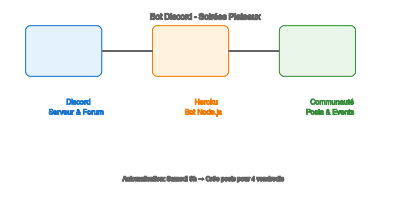
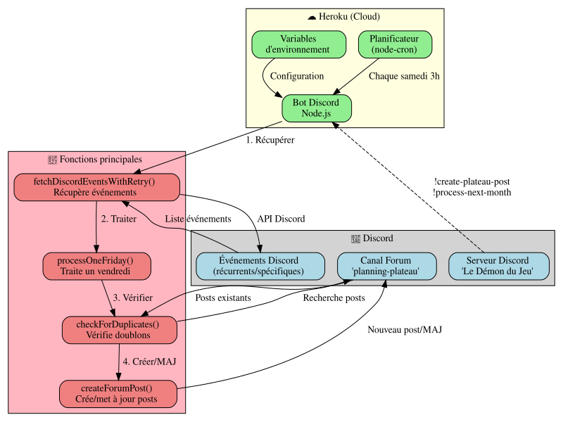
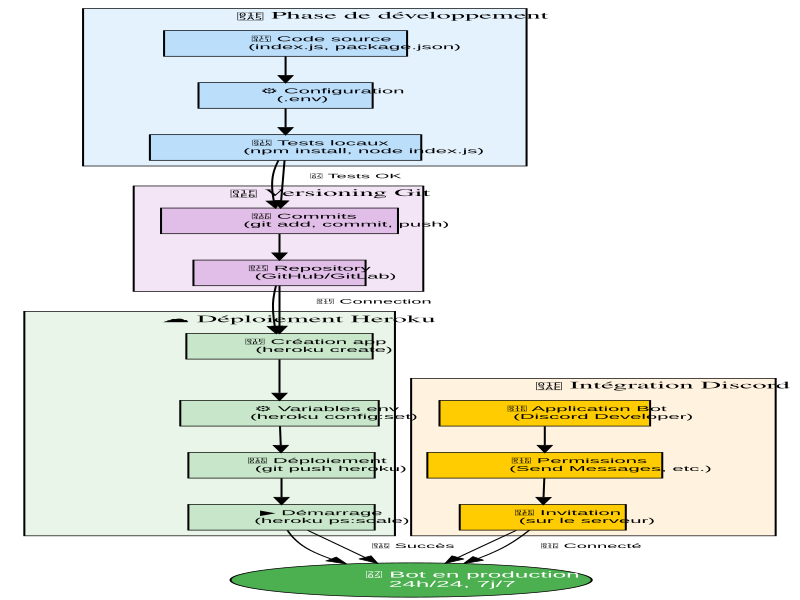
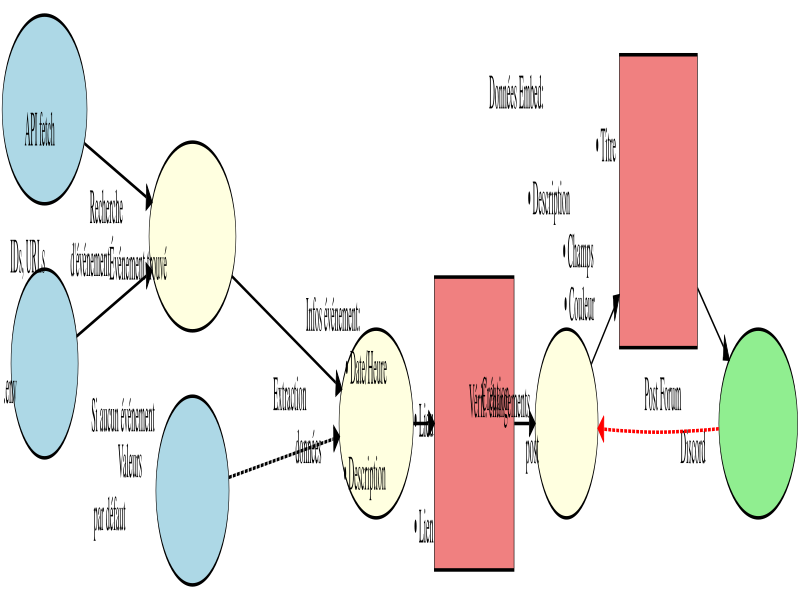
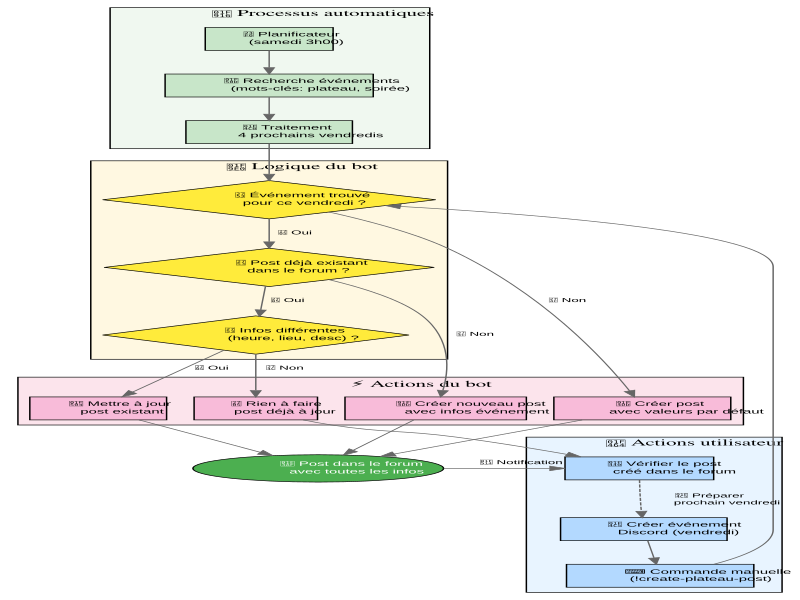
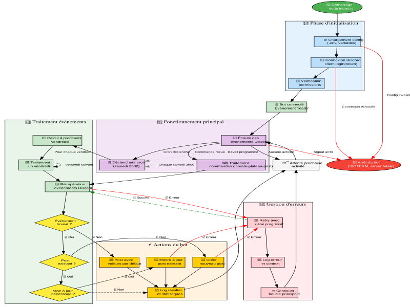

# 🎲 Bot Discord - Soirées Plateaux

Bot Discord intelligent qui crée et met à jour automatiquement des posts dans un forum pour planifier les soirées plateaux du vendredi soir.

## 🚀 Vue d'ensemble rapide

```
┌─────────────────────────────────────────────────────────────┐
│                    🎲 Bot Soirées Plateaux                  │
├─────────────────────────────────────────────────────────────┤
│                                                             │
│  🎮 Discord          ☁️ Heroku           👥 Utilisateurs    │
│  ┌─────────┐         ┌─────────┐         ┌─────────┐        │
│  │Serveur  │◄────────┤Bot Node │────────►│Posts    │        │
│  │Forum    │         │24h/24   │         │Forum    │        │
│  │Events   │         │Cron job │         │Soirées  │        │
│  └─────────┘         └─────────┘         └─────────┘        │
│                                                             │
│  🔄 Processus automatique tous les samedis à 3h00          │
│     📅 Trouve les 4 prochains vendredis                    │
│     🔍 Récupère les événements Discord                     │
│     📝 Crée/met à jour les posts forum                     │
│                                                             │
└─────────────────────────────────────────────────────────────┘
```

## 📖 Fonctionnalités

✅ **Automation complète** - Création de posts chaque samedi à 3h  
✅ **Détection intelligente** - Trouve automatiquement les événements  
✅ **Mise à jour dynamique** - Met à jour si les infos changent  
✅ **Anti-doublon** - Évite les posts multiples  
✅ **Commandes manuelles** - Contrôle total via commandes slash  

## 🔧 Installation rapide

**[📋 Guide d'installation complet](docs/QUICK_INSTALL.md)**

---

## 🖼️ Vue d'ensemble visuelle

<div align="center">



</div>

## 📋 Démarrage rapide

### 🎯 Installation en 15 minutes
👉 **[Guide d'installation rapide](docs/QUICK_INSTALL.md)** - Pour débutants complets

### 📚 Documentation complète  
👉 **[Documentation détaillée](docs/README.md)** - Guide complet avec diagrammes

### 🗂️ Index de la documentation
👉 **[Index général](docs/INDEX.md)** - Navigation dans toute la documentation

### ❓ Problèmes ?
👉 **[FAQ](docs/FAQ.md)** - Réponses aux questions fréquentes

---

## 📖 Navigation rapide

<div align="center">

| [](docs/QUICK_INSTALL.md) | [](docs/README.md) |
|:---:|:---:|
| [](docs/FAQ.md) | [](docs/INDEX.md) |

</div>

## 🎨 Diagrammes du système

<div align="center">

<table>
<tr>
<td align="center" width="25%">
<a href="docs/README.md">

<br><sub><b>🏗️ Architecture</b></sub>
</a>
</td>
<td align="center" width="25%">
<a href="docs/README.md#processus-de-déploiement">

<br><sub><b>🚀 Déploiement</b></sub>
</a>
</td>
<td align="center" width="25%">
<a href="docs/README.md#flux-des-données">

<br><sub><b>📊 Flux de données</b></sub>
</a>
</td>
<td align="center" width="25%">
<a href="docs/FAQ.md">

<br><sub><b>🎮 Workflow</b></sub>
</a>
</td>
</tr>
</table>

</div>

## ✨ Fonctionnalités principales

### 🤖 **Automatisation intelligente**
- ✅ **Planification automatique** : Posts créés chaque samedi à 3h00 du matin
- 🔄 **Mise à jour en temps réel** : Détecte les changements dans les événements Discord
- 📅 **Traitement des 4 prochains vendredis** : Plus pratique qu'un mois entier
- 🛡️ **Protection anti-doublon** : Évite les posts multiples

### 🎯 **Intégration Discord native**
- 📅 **Événements Discord** : Récupère automatiquement date, heure, lieu
- 📍 **Lieux intelligents** : Support physique, salons vocaux, scènes  
- 🔗 **Liens directs** : Vers l'événement Discord spécifique
- 📝 **Descriptions dynamiques** : Utilise le contenu des événements

### 🎨 **Interface soignée**
- 💎 **Embeds Discord élégants** : Messages avec mise en forme
- 🌍 **Fuseaux horaires** : Affichage correct selon votre région
- 🎲 **Thème plateaux** : Émojis et couleurs adaptés

## 🔄 Fonctionnement technique

<div align="center">



*Cliquez sur l'image pour voir tous les diagrammes détaillés*

</div>

### Processus automatique

1. **🕐 Samedi 3h00** → Déclenchement automatique du cron job
2. **🔍 Récupération** → Fetch des événements Discord du serveur  
3. **📅 Filtrage** → Identification des 4 prochains vendredis
4. **🎯 Détection** → Recherche événements "plateau" ou "soirée"
5. **📝 Création/Mise à jour** → Posts forum avec toutes les infos
6. **✅ Vérification** → Anti-doublon et validation
7. **😴 Attente** → Jusqu'au prochain samedi

### Commandes manuelles

- `/create-plateau-post` - Crée un post pour un vendredi spécifique
- `/process-one-friday` - Traite un vendredi donné
- `!process-next-month` - Lance le traitement des 4 vendredis

## 🛠️ Technologies utilisées

- **Node.js** - Runtime JavaScript
- **discord.js v14** - Bibliothèque Discord
- **node-cron** - Planification automatique  
- **Heroku** - Hébergement cloud 24/7
- **Git** - Versioning et déploiement

## 📊 Statistiques du projet


## 🤝 Contribution et support

- **Issues** : [Créer un ticket](https://github.com/Kiwi41/discord-plateau-bot/issues)
- **Documentation** : [Guide complet](docs/README.md)
- **FAQ** : [Questions fréquentes](docs/FAQ.md)

## 📄 Licence et crédits

Projet open-source développé pour automatiser la gestion des soirées plateaux sur Discord.

---

<div align="center">

**[🚀 Commencer maintenant](docs/QUICK_INSTALL.md)** • **[📚 Documentation](docs/README.md)** • **[❓ Support](docs/FAQ.md)**

</div>