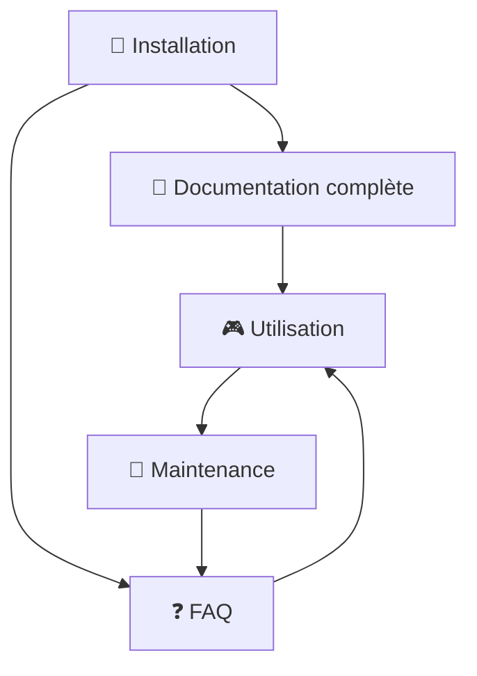

# 📚 Index de la documentation - Bot Discord Plateaux

Bienvenue dans la documentation complète du Bot Discord pour Soirées Plateaux ! Cette page vous guide vers les bonnes ressources selon vos besoins.

## 🎯 Par où commencer ?

### 🚀 Je veux installer le bot rapidement (15 min)
👉 **[Guide d'installation rapide](QUICK_INSTALL.md)**
- Installation en 15 minutes
- Étapes simplifiées pour débutants
- Checklist complète

### 📚 Je veux comprendre tout en détail  
👉 **[Documentation complète](README.md)**
- Architecture du système avec diagrammes
- Guide d'installation détaillé
- Configuration avancée
- Maintenance et monitoring

### ❓ J'ai un problème ou une question
👉 **[FAQ - Questions fréquentes](FAQ.md)**
- Solutions aux problèmes courants
- Dépannage étape par étape
- Conseils de configuration

## 📋 Documentation par catégorie

### 🔧 Installation et configuration
| Document | Description | Niveau |
|----------|-------------|---------|
| [QUICK_INSTALL.md](QUICK_INSTALL.md) | Installation rapide en 15 minutes | 🟢 Débutant |
| [README.md](README.md) | Documentation complète | 🟡 Intermédiaire |
| [../.env.example](../.env.example) | Exemple de configuration | 🟢 Tous niveaux |

### 🛠️ Dépannage et support  
| Document | Description | Contenu |
|----------|-------------|---------|
| [FAQ.md](FAQ.md) | Questions fréquentes | 30+ questions/réponses |
| [README.md](README.md) | Section dépannage | Logs, diagnostic, monitoring |

### 🎨 Diagrammes et schémas
| Fichier | Description | Type |
|---------|-------------|------|
| [architecture.svg](architecture.svg) | Architecture du système | Diagramme technique |
| [data_flow.svg](data_flow.svg) | Flux des données | Processus métier |
| [deployment.svg](deployment.svg) | Processus de déploiement | Workflow |
| [user_workflow.svg](user_workflow.svg) | Workflow utilisateur | Guide d'utilisation |
| [bot_lifecycle.svg](bot_lifecycle.svg) | Cycle de vie du bot | Processus technique |
| [event_processing.svg](event_processing.svg) | Traitement événement | Algorithme détaillé |

## 🎯 Par niveau d'expérience

### 🟢 Débutant complet (niveau 0)
1. **Commencez ici** : [Guide rapide](QUICK_INSTALL.md)
2. **En cas de problème** : [FAQ section Installation](FAQ.md#-installation-et-déploiement)
3. **Pour comprendre** : [README - Fonctionnalités](README.md#-fonctionnalités-principales)

### 🟡 Utilisateur intermédiaire
1. **Documentation complète** : [README.md](README.md)
2. **Configuration avancée** : [FAQ section Configuration](FAQ.md#-configuration-et-personnalisation)
3. **Maintenance** : [README - Monitoring](README.md#-monitoring)

### 🔴 Développeur / Admin système
1. **Architecture technique** : [README - Structure](README.md#-structure-du-projet)
2. **Personnalisation** : [FAQ section Développeurs](FAQ.md#-fonctionnalités-avancées)
3. **Déploiement** : [README - Heroku](README.md#-déploiement-heroku)

## 🔍 Recherche rapide

### Par problème spécifique
- **Bot ne se connecte pas** → [FAQ - "Bot connecté mais rien ne se passe"](FAQ.md#--bot-connecté-mais-rien-ne-se-passe)
- **Posts avec valeurs par défaut** → [FAQ - "Bot crée des posts avec valeurs par défaut"](FAQ.md#--le-bot-crée-des-posts-avec-des-valeurs-par-défaut)
- **Erreur de permissions** → [FAQ - "Missing permissions"](FAQ.md#--erreur--missing-permissions)
- **Problème d'installation** → [Guide rapide - Section 🆘](QUICK_INSTALL.md#-problème-)

### Par tâche à accomplir
- **Installer le bot** → [Guide rapide](QUICK_INSTALL.md) puis [README](README.md)
- **Configurer les variables** → [.env.example](../.env.example) et [FAQ](FAQ.md)
- **Déployer sur Heroku** → [README - Déploiement](README.md#-déploiement-heroku)
- **Personnaliser les messages** → [FAQ - Modifier le message](FAQ.md#--comment-modifier-le-message-du-post-)
- **Changer l'horaire** → [FAQ - Changer planification](FAQ.md#--puis-je-changer-la-planification-automatique-)

## 📊 Diagrammes explicatifs

### 🏗️ Architecture et fonctionnement

### 📋 Flux de lecture recommandé
1. **📖 Aperçu** : [README principal du projet](../README.md)
2. **🚀 Installation** : [Guide rapide](QUICK_INSTALL.md) OU [Documentation complète](README.md)
3. **⚙️ Configuration** : [Exemple .env](../.env.example)
4. **🎮 Utilisation** : [README - Commandes](README.md#-commandes-disponibles)
5. **❓ Support** : [FAQ](FAQ.md) selon besoin

## 🆘 Aide urgente

### ⚡ Problème critique (bot arrêté)
1. **Vérifiez les logs** : `heroku logs --tail`
2. **Redémarrez** : `heroku restart`
3. **Consultez** : [FAQ - Dépannage](FAQ.md#-dépannage)

### 🔧 Installation qui bloque
1. **Prérequis manquants** : [Guide rapide - Checklist](QUICK_INSTALL.md#-checklist-avant-de-commencer)
2. **Erreurs courantes** : [FAQ - Installation](FAQ.md#-installation-et-déploiement)
3. **Variables d'environnement** : [Exemple .env](../.env.example)

### ❓ Besoin d'aide supplémentaire
1. **Documentation** : Relisez les sections pertinentes
2. **Logs détaillés** : Activez le debug dans le code
3. **Support communautaire** : Discord.js, Heroku docs

## 📝 Légende des niveaux

| Niveau | Description | Public cible |
|---------|-------------|--------------|
| 🟢 **Débutant** | Aucune connaissance technique requise | Utilisateurs finaux |
| 🟡 **Intermédiaire** | Notions de base en informatique | Admins serveur Discord |
| 🔴 **Avancé** | Compétences techniques | Développeurs, DevOps |

## 🎉 Vous avez tout configuré ?

### ✅ Checklist finale
- [ ] Bot installé et déployé
- [ ] Variables d'environnement configurées  
- [ ] Premier post test créé avec `!create-plateau-post`
- [ ] Logs surveillés et propres
- [ ] Documentation bookmark pour référence future

### 🚀 Étapes suivantes
- 🎲 **Profitez** de vos soirées plateaux automatisées !
- 📊 **Surveillez** les logs périodiquement 
- 🔧 **Personnalisez** selon vos besoins
- 📚 **Partagez** cette documentation avec votre équipe

---

*Documentation créée le 8 octobre 2025 - Bot Discord Plateaux v1.0*