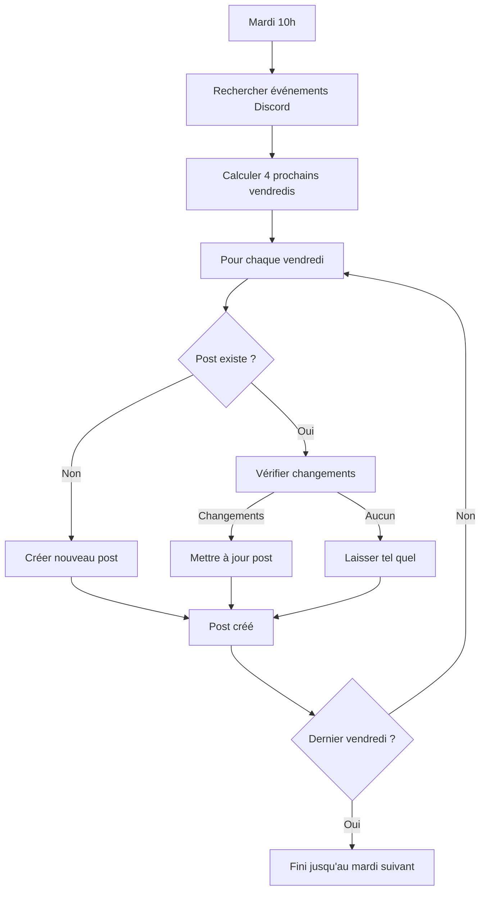
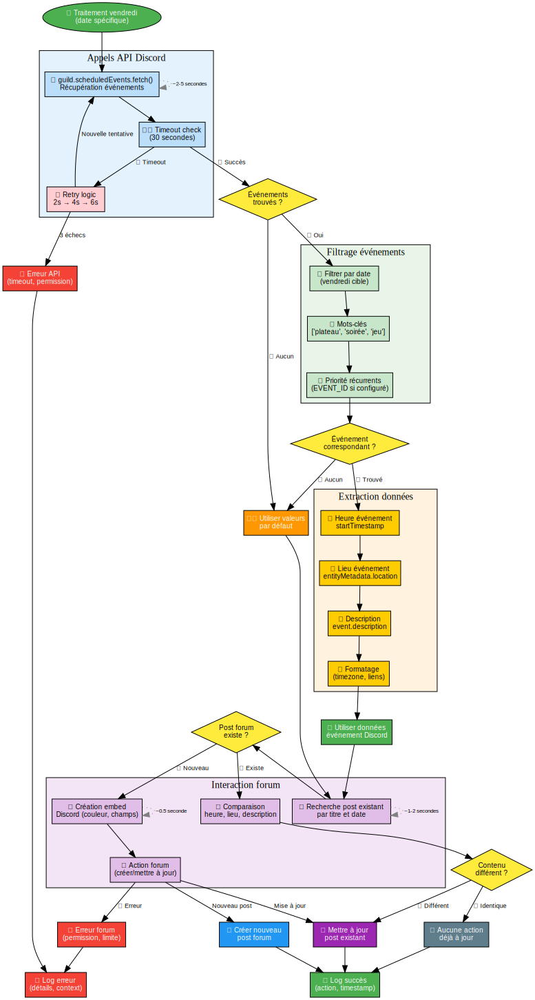

# 🎲 Bot Discord pour Soirées Plateaux - Documentation Complète

## 📋 Table des matières

1. [Introduction](#introduction)
2. [Qu'est-ce que ce bot ?](#quest-ce-que-ce-bot)
3. [Comment ça fonctionne ?](#comment-ça-fonctionne)
4. [Architecture du système](#architecture-du-système)
5. [Installation et configuration](#installation-et-configuration)
6. [Utilisation](#utilisation)
7. [Dépannage](#dépannage)
8. [Maintenance](#maintenance)

---

## 🎯 Introduction

Ce bot Discord a été créé pour **automatiser la gestion des soirées plateaux** dans votre serveur Discord. Il crée automatiquement des posts dans un forum pour planifier les soirées jeux de plateau du vendredi soir.

### 🎪 Pour qui ?

- **Communautés de jeux de plateau** 
- **Serveurs Discord** organisant des événements récurrents
- **Gestionnaires de communautés** voulant automatiser la planification

---

## 🤖 Qu'est-ce que ce bot ?

### Fonctionnalités principales

✅ **Création automatique de posts** chaque mardi à 10h  
✅ **Récupération d'informations** depuis les événements Discord  
✅ **Gestion intelligente des doublons** (pas de posts multiples)  
✅ **Mise à jour automatique** si les infos changent  
✅ **Commandes manuelles** pour créer ou traiter les posts  
✅ **Support des fuseaux horaires**  

### Ce que fait le bot concrètement

1. **Chaque mardi à 10h** → Crée des posts pour les 4 prochains vendredis
2. **Récupère les infos** → Heure, lieu, description depuis Discord
3. **Poste dans le forum** → Message avec toutes les infos importantes
4. **Met à jour** → Si tu changes l'événement, le post se met à jour

---

## 🔄 Comment ça fonctionne ?

### Le cycle de vie du bot



### Types d'événements gérés

Le bot peut gérer différents types d'événements Discord :

1. **Événements spécifiques** : Créés pour un vendredi précis
2. **Événements récurrents** : Se répètent chaque semaine
3. **Valeurs par défaut** : Si aucun événement n'est trouvé

---

## 🏗️ Architecture du système

### Vue d'ensemble


Le système est composé de plusieurs éléments qui travaillent ensemble :

#### 🎮 Discord (Interface utilisateur)
- **Serveur Discord** : Où se trouve votre communauté
- **Canal Forum** : Où les posts sont créés (ex: `#planning-plateau`)
- **Événements Discord** : Source d'informations (date, heure, lieu)

#### ☁️ Heroku (Hébergement cloud)
- **Bot Node.js** : Le programme principal qui tourne 24h/24
- **Planificateur** : Déclenche les actions automatiquement
- **Variables d'environnement** : Configuration sécurisée

#### 🔧 Fonctions principales
- **Récupération d'événements** : Se connecte à Discord pour récupérer les infos
- **Traitement des vendredis** : Calcule et traite chaque vendredi
- **Création de posts** : Génère les messages du forum
- **Vérification des doublons** : Évite les posts multiples

### Flux des données


Les données circulent ainsi :
1. **Événements Discord** → Récupérés via l'API Discord
2. **Traitement** → Extraction et formatage des informations
3. **Post Forum** → Création du message avec embed Discord

### Processus de déploiement


Le déploiement suit ces étapes :
1. **Développement local** → Code, configuration, tests
2. **Versioning Git** → Sauvegarde et suivi des modifications
3. **Heroku** → Déploiement cloud automatique
4. **Discord** → Configuration du bot et permissions
5. **Production** → Bot actif 24h/24

### Workflow utilisateur


Le bot fonctionne de deux façons :
- **Automatique** : Chaque samedi, traite les 4 prochains vendredis
- **Manuel** : Via les commandes `!create-plateau-post` et `!process-next-month`

### Cycle de vie du bot


Le cycle de vie complet du bot :
1. **Démarrage** : Initialisation et connexion Discord
2. **Boucle principale** : Écoute des événements et commandes
3. **Traitement** : Gestion des événements avec retry et logging
4. **Attente** : Veille jusqu'à la prochaine activité

### Traitement détaillé d'un événement



Processus détaillé pour traiter un vendredi spécifique :
1. **API Discord** : Récupération avec retry automatique
2. **Filtrage** : Par date, mots-clés et priorité récurrente
3. **Extraction** : Heure, lieu, description avec formatage
4. **Forum** : Création ou mise à jour avec comparaison intelligente

---

## 📦 Installation et configuration

### Prérequis

Avant de commencer, tu as besoin de :

- [ ] Un **compte Discord** avec un serveur
- [ ] Un **compte Heroku** (gratuit)
- [ ] **Node.js** installé sur ton ordinateur (pour le développement)
- [ ] **Git** installé sur ton ordinateur

### Étape 1 : Créer le bot Discord

#### 1.1 Aller sur le portail développeur Discord
1. Va sur https://discord.com/developers/applications
2. Clique sur "New Application"
3. Donne un nom à ton application (ex: "Bot Plateaux")

#### 1.2 Créer le bot
1. Dans le menu de gauche, clique sur "Bot"
2. Clique sur "Add Bot"
3. **Important** : Note le **Token** (garde-le secret !)

#### 1.3 Configurer les permissions
Le bot a besoin de ces permissions :
- ✅ Send Messages
- ✅ Create Public Threads
- ✅ Send Messages in Threads
- ✅ Embed Links
- ✅ Use Slash Commands

#### 1.4 Inviter le bot sur ton serveur
1. Va dans "OAuth2" > "URL Generator"
2. Sélectionne "bot" et les permissions ci-dessus
3. Copie l'URL générée et ouvre-la dans ton navigateur
4. Sélectionne ton serveur et autorise le bot

### Étape 2 : Récupérer les IDs Discord

Tu vas avoir besoin de plusieurs identifiants Discord. Voici comment les trouver :

#### 2.1 Activer le mode développeur
1. Dans Discord, va dans "Paramètres utilisateur" (roue dentée)
2. "Avancé" → Active "Mode développeur"

#### 2.2 Récupérer les IDs
- **Guild ID (Serveur)** : Clic droit sur ton serveur → "Copier l'ID"
- **Channel ID (Forum)** : Clic droit sur ton canal forum → "Copier l'ID"  
- **Event ID** (optionnel) : Clic droit sur un événement → "Copier l'ID"

### Étape 3 : Configurer les variables d'environnement

Crée un fichier `.env` avec ces informations :

```bash
# Token du bot Discord (OBLIGATOIRE)
DISCORD_TOKEN=ton_token_bot_ici

# ID du serveur Discord (OBLIGATOIRE)  
GUILD_ID=ton_guild_id_ici

# ID du canal forum (OBLIGATOIRE)
FORUM_CHANNEL_ID=ton_forum_channel_id_ici

# URL d'inscription (OBLIGATOIRE)
REGISTRATION_URL=https://ton-lien-inscription.com

# Fuseau horaire (OPTIONNEL)
TIMEZONE=Europe/Paris

# ID événement récurrent (OPTIONNEL)
# EVENT_ID=ton_event_id_ici
```

### Étape 4 : Déployer sur Heroku

#### 4.1 Préparation locale
```bash
# Cloner ou télécharger le code
git clone https://github.com/ton-repo/discord-plateau-bot.git
cd discord-plateau-bot

# Installer les dépendances
npm install
```

#### 4.2 Configuration Heroku
```bash
# Créer l'application Heroku
heroku create nom-de-ton-app

# Configurer les variables d'environnement
heroku config:set DISCORD_TOKEN=ton_token
heroku config:set GUILD_ID=ton_guild_id
heroku config:set FORUM_CHANNEL_ID=ton_channel_id
heroku config:set REGISTRATION_URL=ton_url
heroku config:set TIMEZONE=Europe/Paris

# Déployer
git push heroku master

# Démarrer le bot
heroku ps:scale worker=1
```

---

## 🎮 Utilisation

### Commandes disponibles

Le bot répond à ces commandes dans Discord :

| Commande | Description | Qui peut l'utiliser |
|----------|-------------|-------------------|
| `!create-plateau-post` | Crée un post pour le prochain vendredi | Admins |
| `!process-next-month` | Crée des posts pour les 4 prochains vendredis | Admins |  
| `!plateau-help` | Affiche l'aide | Tous |

### Fonctionnement automatique

#### ⏰ Planification automatique
- **Quand** : Chaque samedi à 3h00 du matin
- **Quoi** : Traite les 4 prochains vendredis
- **Timezone** : Selon ta configuration (défaut: Europe/Paris)

#### 🔄 Mise à jour intelligente
Le bot met à jour les posts si :
- L'heure de l'événement change
- Le lieu change  
- La description change
- Le lien vers l'événement change

### Exemple de post généré

Le bot crée des posts comme celui-ci :

```
🎲 Soirée Plateaux du Vendredi ! 🎲

🎲 Soirée Plateaux du vendredi !

Venez découvrir et jouer à une grande variété de jeux de plateau dans une ambiance conviviale !

🎯 Au programme :
• Jeux de stratégie, coopératifs, party games...
• Accueil des débutants et confirmés  
• Ambiance détendue et bonne humeur garantie

Rendez-vous 20:30 pour une soirée inoubliable ! 🎉

📅 Date: vendredi 10 octobre 2025
🕖 Heure: 20:30  
📍 Lieu: 📍 Le Cube en Bois
🎯 Événement Discord: [Rejoindre l'événement Discord](https://discord.com/events/...)
```

---

## 🔧 Dépannage

### Problèmes courants et solutions

#### ❌ "Bot connecté mais rien ne se passe"

**Causes possibles :**
- Le bot n'a pas les bonnes permissions
- Les IDs sont incorrects  
- Le canal forum n'existe pas

**Solutions :**
1. Vérifie les permissions du bot
2. Vérifie les IDs dans les variables d'environnement
3. Regarde les logs : `heroku logs --tail`

#### ❌ "Impossible de récupérer les événements Discord"

**Causes possibles :**
- Timeout réseau
- Pas d'événements créés
- Bot pas dans le bon serveur

**Solutions :**
1. Le bot fait des retry automatiques
2. Crée des événements Discord pour les vendredis
3. Vérifie que le bot est bien sur le serveur

#### ❌ "Posts créés mais avec valeurs par défaut"

**Causes possibles :**
- Aucun événement trouvé pour ce vendredi
- Événement récurrent mal configuré
- Mots-clés de recherche ne correspondent pas

**Solutions :**
1. Crée des événements Discord avec "plateau" ou "soirée" dans le nom
2. Vérifie l'EVENT_ID si tu en as un
3. Regarde les logs pour voir ce qui est trouvé

### Commandes de diagnostic

```bash
# Voir les logs en temps réel  
heroku logs --tail

# Voir les logs des 100 dernières lignes
heroku logs -n 100

# Voir le statut du bot
heroku ps

# Voir la configuration
heroku config

# Redémarrer le bot
heroku restart
```

### Logs importants à surveiller

✅ **Bon fonctionnement :**
```
🤖 Bot connecté en tant que Bot Soirées Plateaux#2860!
✅ 10 événements trouvés sur le serveur  
✅ Événement récurrent trouvé: Soirée plateaux (ID: ...)
✅ Post créé: Soirée Plateaux - vendredi 10 octobre 2025
```

❌ **Problèmes :**
```
⚠️ Impossible de récupérer les événements Discord: Timeout
❌ Serveur Discord non trouvé
❌ Canal forum non trouvé  
⚠️ Utilisation de l'URL d'inscription générique
```

---

## 🔧 Maintenance

### Tâches régulières

#### Hebdomadaire
- [ ] Vérifier que les posts sont bien créés
- [ ] S'assurer que les événements Discord sont à jour

#### Mensuel  
- [ ] Vérifier les logs d'erreurs
- [ ] Mettre à jour les liens d'inscription si nécessaire

#### Selon les besoins
- [ ] Ajouter de nouveaux mots-clés de recherche
- [ ] Modifier les valeurs par défaut
- [ ] Ajuster la planification

### Modifier la configuration

#### Changer l'heure de planification
Dans `index.js`, ligne ~750 :
```javascript
// Actuel : samedi à 3h00
cron.schedule('0 3 * * 6', () => {

// Pour mardi à 10h00 :  
cron.schedule('0 10 * * 2', () => {
```

#### Modifier les valeurs par défaut
Dans `index.js`, cherche "valeurs par défaut" et modifie :
```javascript
eventTime = '20:30'; // Heure par défaut
eventLocation = '📍 [Le Cube en Bois](...)'; // Lieu par défaut
```

#### Ajouter des mots-clés de recherche
Dans `index.js`, cherche "keywords" et ajoute :
```javascript
const keywords = ['plateau', 'soirée', 'jeu', 'board', 'game', 'nouveau_mot'];
```

### Sauvegarde et restauration

#### Sauvegarder la configuration
```bash
# Sauvegarder les variables d'environnement
heroku config > config_backup.txt

# Sauvegarder le code
git clone https://github.com/ton-repo/discord-plateau-bot.git backup/
```

#### Restaurer après problème
```bash
# Restaurer les variables
heroku config:set $(cat config_backup.txt)

# Redéployer le code
git push heroku master --force

# Redémarrer
heroku restart
```

---

## 📞 Support

### Où trouver de l'aide

1. **Logs d'erreur** : `heroku logs --tail`
2. **Documentation Discord.js** : https://discord.js.org/
3. **Documentation Heroku** : https://devcenter.heroku.com/
4. **Documentation Node-cron** : https://www.npmjs.com/package/node-cron

### Informations utiles pour le support

Si tu as besoin d'aide, prépare ces informations :

- Version du bot (voir `package.json`)
- Logs d'erreur complets
- Configuration (sans les tokens !)
- Description du problème
- Quand le problème est apparu

---

## 📝 Annexes

### Structure des fichiers

```
discord-plateau-bot/
├── index.js              # Code principal du bot
├── package.json           # Dépendances et métadonnées  
├── Procfile              # Configuration Heroku
├── .env.example          # Exemple de configuration
├── .gitignore            # Fichiers à ignorer par Git
├── README.md             # Documentation courte
└── docs/                 # Documentation complète
    ├── README.md         # Ce fichier
    ├── architecture.svg  # Schéma d'architecture
    └── data_flow.svg     # Schéma de flux de données
```

### Technologies utilisées

| Technologie | Version | Usage |
|-------------|---------|-------|
| **Node.js** | ≥18.0.0 | Runtime JavaScript |
| **discord.js** | ^14.14.1 | API Discord |
| **node-cron** | ^3.0.3 | Planification automatique |
| **dotenv** | ^16.3.1 | Variables d'environnement |
| **Heroku** | - | Hébergement cloud |

### Glossaire

**API** : Interface de programmation qui permet au bot de communiquer avec Discord

**Bot Discord** : Programme automatisé qui peut interagir dans un serveur Discord

**Embed** : Message Discord enrichi avec couleurs, champs et formatage

**EVENT_ID** : Identifiant unique d'un événement Discord

**Forum Channel** : Type de canal Discord où on peut créer des posts/threads

**GUILD_ID** : Identifiant unique d'un serveur Discord

**Heroku** : Service cloud pour héberger des applications

**Node.js** : Environnement pour exécuter du JavaScript côté serveur

**Token** : Clé secrète qui authentifie le bot auprès de Discord

**Webhook** : URL qui permet de recevoir des données automatiquement

---

## 🎉 Conclusion

Félicitations ! Tu as maintenant un bot Discord entièrement automatisé pour gérer tes soirées plateaux. 

### Ce que tu as accompli :
✅ Bot Discord configuré et déployé  
✅ Automation complète des posts de planning  
✅ Intégration avec les événements Discord  
✅ Système robuste avec gestion d'erreurs  
✅ Maintenance et monitoring en place  

### Prochaines étapes possibles :
🚀 Ajouter des notifications par DM  
🚀 Créer des statistiques de participation  
🚀 Intégrer avec d'autres systèmes (calendrier, etc.)  
🚀 Ajouter des commandes interactives  

**Amuse-toi bien avec tes soirées plateaux ! 🎲**

---

*Documentation créée le 8 octobre 2025 - Version 1.0*